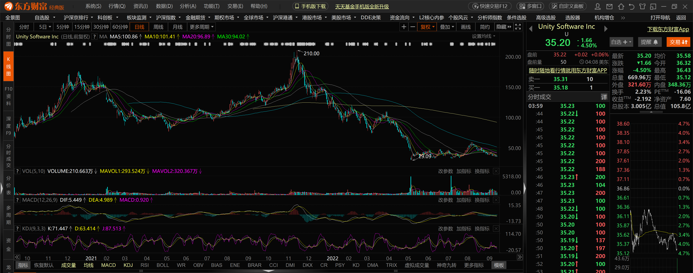
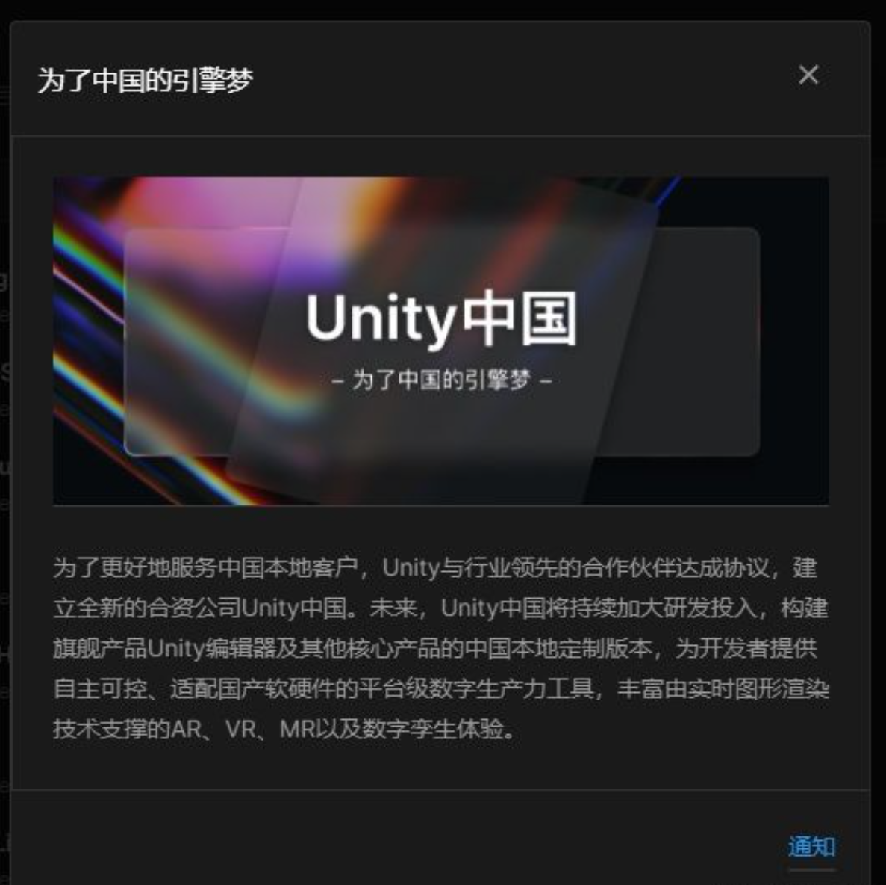
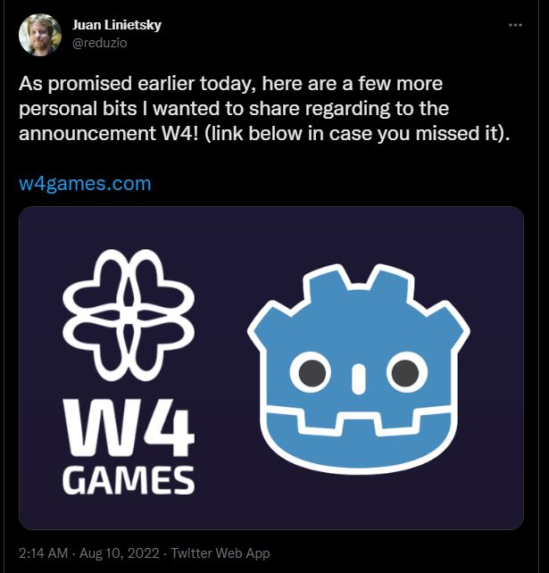
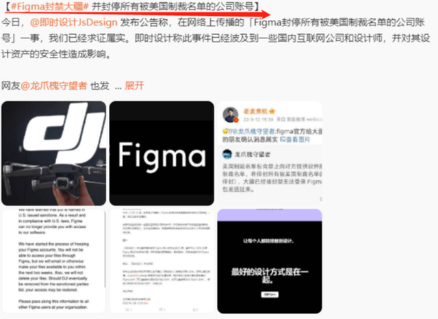
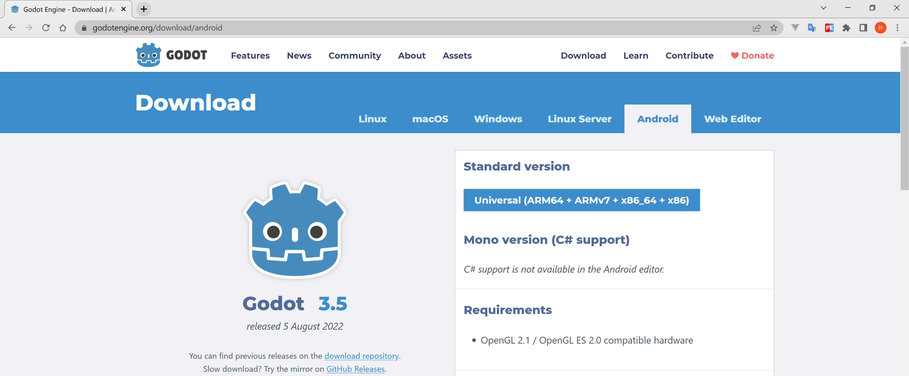

8月9日，Unity将把在中国的创建解决方案业务以及游戏服务业务注入新合资公司Unity中国，引入阿里巴巴、中国移动、吉比特、米哈游、OPPO、抖音集团、佳都科技这几家投资伙伴。

```
Unity Software是美国知名游戏引擎开发商，总部位于美国旧金山。
其同名软件Unity引擎全球最受欢迎的游戏开发引擎，也在2012年进入中国后为中国许多知名手游提供动力，如腾讯的《王者荣耀》和米哈游的《原神》等。
```

官方称，Unity中国将增进与本土企业的合作以寻求全新的发展机会，并增加研发投入以更好地满足中国创作者社区的需求。 短期内，Unity 中国将开始为游戏开发者构建其核心产品的本地定制版本，包括旗舰产品 Unity 编辑器的中国版。
Unity中国还将成为Unity全球产品和服务在中国地区的独家经销商。

```
据称，Unity之所以计划分拆业务，是由于希望看到其软件在中国获得更广泛的应用，包括从智能城市、工业设计到元宇宙等多个领域。
分拆将有助于其在中国市场的扩张，因为这将使其中国部门拥有更多的运营自主权，增加其对地方政府和国有合作伙伴的吸引力。
```

根据最新财报数据，2022年第二季度，Unity来自大中华区（包括中国大陆和中国香港、中国台湾）的营收为4229万美元，同比增长9.4%，在整体营收中占比14.2%。大中华区现在也是Unity增速最快的市场大区之一。

**为什么Unity突然要搞这出？我们可以从经济角度去分析**



unity从上市以来一直处于亏损状态，现在搞这出无非是为了到中国捞钱。 然后最近unity中国的特供版已经到了疯狂的程度，疯狂到一天一激活，搞了unity大学培训机构割韭菜，广告开始吹起来了，体验倒是没有提升多少。
还说搞什么中国自己的引擎，真是笑死人了。用过那个unity hub，懂得都懂，前段时间还严查授权，把我个人账号封了。 之前我公司买了unity的套装，结果还是经常被封，只能被迫使用xx版本。
其实你搞中国特供版我并没有意见，问题是为什么我用科学上网，用了外网的版本就不用一天一激活了？你甚至可以用许可证个人版本永久免费试用。

```
Unity将迎来近三年首次价格上调，Unity官方平台9月13日在官微发布通知称，
从10月13日21点开始，Unity Pro专业版、Unity Enterprise企业版和Unity Industrial Collection工业套件订阅方案的价格调整如下：
Unity Pro专业版年度订阅的价格调整为15675.36人民币/年，月度订阅的价格调整为1306.28人民币/月。
Unity Enterprise企业版年度订阅的价格调整为23052.00人民币/年。Unity Industrial Collection工业套件年度订阅的价格调整为23278.00人民币/年。
```



现在unity进步太慢了，godot 4的里程碑版本马上就来了，在5年可以预期的未来，3d方面的差距一定是逐渐减小的。
按照unity这个中国特供版的尿性，我有预感，untiy作死的路上越来越远。而就在几乎在同一期间，w4game成立，拭目以待。
godot据说天使轮融资是850w美元，天使轮的投资额度是非常高的，后面A轮，B轮的融资应该越来越高，这个应该是可以预见的。
godot这个融资相当于做godot生态的配套，类似于Redhat之于Linux，以后用godot大概率可以发布到ps这种商业平台，这个绝对是好的现象。
我们不需要排斥资本，反而应该意识到资本已经看到了godot的潜力，就像当年资本看到了Redhat的潜力一样。


**为什么Unity突然要搞这出？从另一个角度分析，中美贸易战争升级**

- 单说今年软件被封锁的，之前什么matlab之流的就不说了

```
3月15日，美国软件公司Figma已与大疆公司断绝关系，以遵守美国的制裁。这是继华为之后，另一家总部位于深圳的科技巨头大疆，成为美国单边行动的目标
8月15日，美国对设计GAAFET（全栅场效应晶体管）结构集成电路所必须的EDA软件禁令正式生效。
```



- 谁能够保证，未来unity 和 ue断供和制裁，有的人会说ue是tencent的，不要太天真了，实际控制权等于没有。

```
2012年7月，腾讯以3.3亿美元收购EpicGames已发行股本48.4%的股份。
2021/5/6，知情人士透露，腾讯控股自 2020 年末以来一直在与美国外国投资委员会（CFIUS）进行谈判，以确保其能够继续持有 Riot Games 和 Epic Games 的股份。
```

- unity突然搞出这手，就是为了避免以后更好的在大陆捞钱，实际上这个只是一个运营本地化公司，核心技术没有，成立了unity 中国又怎么样

**最后说说为什么选择godot**

- 开源，社区驱动，想想linux，甚至引擎自带的脚本语言GdScript都是开源的

- 其它不是非常重要的原因
```
技术路线的选择，godot编辑器可以运行在web和android上，想象空间巨大

现在很多小学生都有自己的平板电脑，如果游戏引擎能运行在这些平板电脑那么就像现在的pyhon一样简单强大了

unity和ue甚至连在linux上都运行不了
```


