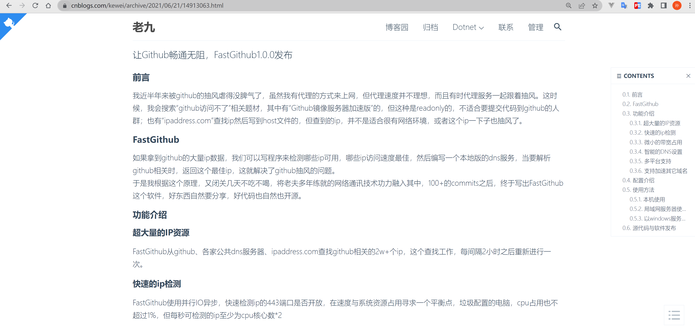
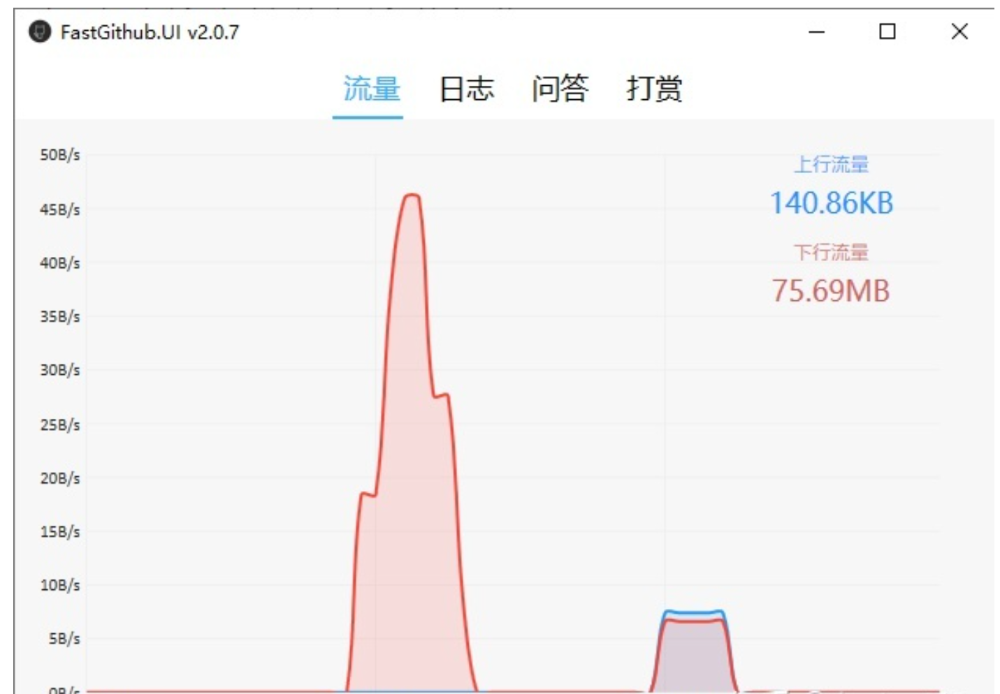

# 使用FastGithub流畅玩耍github，从此再也不用担心被蔷了

- 最近有同学抱怨说，经常因连不上github导致程序无法安装成功。

- 很多需要用到的脚本及软件会先发布在GitHub上，所以经常需要访问GitHub，但是每次都会卡在跳转到GitHub的步骤，就是还没开始就可以结束了。

- 试了很多种方法，终于找到一个稳定可靠的选择：FastGithub。而且同时支持win, linux, mac，使用很方便。

## 1.你为什么访问不到github

- 因为你的所有网络通信包，都要经过国家建造的长城防火墙（代理服务器），长城防火墙每年拦截了大量来自海外的攻击，当然有时候也会被错杀

- github上有大量敏感字，有时候经常会被检索到，导致启动防火程序

- 我们可以打开站长之家去看看github哪些ip访问快，然后设置自己的host，就能达到简单的快速访问目的（不推荐这种方式，经常要改）

## 2.FastGithub原理

- 从公共dns服务器拿到github的大量ip数据，检测哪些ip可用，哪些ip访问速度最佳，然后编写一个本地版的dns服务，当要解析github相关时，返回这个最佳ip。

- [github下载地址](https://github.com/dotnetcore/FastGithub)

- [百度网盘 下载](https://pan.baidu.com/s/1ey0XYO01ycJGwSvvo1zOvQ?pwd=m1l7#list/path=%2Fsharelink1040559712-88251361124674%2FFastGithub&parentPath=%2Fsharelink1040559712-88251361124674)

## 3.使用方法

### 3.1windows

- win下使用最方便，解压后直接双击运行FastGithub.UI.exe即可，自带图形界面。后面这个软件会自动帮你设置host

## 4.终极解决办法

- 科学尚网
