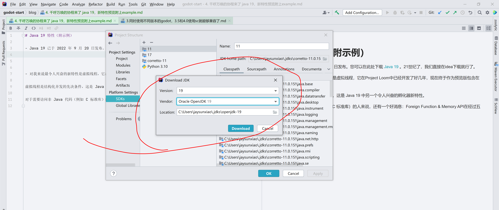

# 千呼万唤的协程来了 java 19，新特性预览附上example（示例）

- Java 19 已于 2022 年 9 月 20 日发布。您可以在此处下载 [Java 19](https://jdk.java.net/19/) ，或者我们直接在idea下载Jdk 19。



- 对我来说最令人兴奋的新特性是虚拟线程（协程），它在Project Loom中已经开发了好几年，现在终于作为预览版包含在 JDK 中。

- 协程是现代web并发的神器，这是 Java 19 中另一个令人兴奋的孵化器新特性。这个版本的协程可以用了，预期在下个版本将彻底release。

- 对于需要访问非 Java 代码（例如 C 标准库）的人来说，还有一个好消息：Foreign Function & Memory API在经过五轮孵化后已进入预览阶段。


### 协程（预览）


- 对我来说，Java 19 中最令人兴奋的创新是“虚拟线程”。虚拟线程已经在Project Loom中开发了几年，目前只能使用自编译的 JDK 进行测试。


- 使用 Thread.startVirtualThread()，此方法创建一个新的虚拟线程来执行给定的 Runnable 任务。

```
Runnable runnable = () -> System.out.println("Virtual Thread");
Thread.startVirtualThread(runnable);

//or

Thread.startVirtualThread(() -> {
    //Code to execute in virtual thread
    System.out.println("Virtual Thread");
});
```

- 使用 Thread.Builder

```
Runnable runnable = () -> System.out.println("Virtual Thread");
Thread virtualThread = Thread.ofVirtual().start(runnable);
```

```
Thread.Builder builder = Thread.ofPlatform().name("Platform-Thread");

Thread t1 = builder.start(() -> {...}); 
Thread t2 = builder.start(() -> {...});
```

### 外部函数和内存 API（预览版）

- Foreign Function & Memory API 允许直接从Java 访问本机内存（即Java 堆外的内存）和访问本机代码（例如C 库）。

```
public class FFMTest {
  public static void main(String[] args) throws Throwable {
    // 1. Get a lookup object for commonly used libraries
    SymbolLookup stdlib = Linker.nativeLinker().defaultLookup();

    // 2. Get a handle to the "strlen" function in the C standard library
    MethodHandle strlen = Linker.nativeLinker().downcallHandle(
        stdlib.lookup("strlen").orElseThrow(), 
        FunctionDescriptor.of(JAVA_LONG, ADDRESS));

    // 3. Convert Java String to C string and store it in off-heap memory
    MemorySegment str = implicitAllocator().allocateUtf8String("Happy Coding!");

    // 4. Invoke the foreign function
    long len = (long) strlen.invoke(str);

    System.out.println("len = " + len);
  }
}
```

### 开关的模式匹配（第三次预览）

- 在 Java 19 中，JDK Enhancement Proposal 427更改了所谓的“受保护模式”的语法（在上面的示例中为“ String s && s.length() > 5”）。取而代之的是&&，我们现在必须使用 new
  关键字when。

```
switch (obj) {
  case String s when s.length() > 5 -> System.out.println(s.toUpperCase());
  case String s                     -> System.out.println(s.toLowerCase());

  case Integer i                    -> System.out.println(i * i);

  default -> {}
}
```

### 记录模式（预览）

- 我最好用一个例子来解释什么是记录模式。假设我们定义了以下记录：

```
public record Position(int x, int y) {}
```


### System.out 和 System.err 的新系统属性

如果您使用 Java 19 运行现有应用程序，您可能会在控制台上看到问号而不是特殊字符。

这是因为，从 Java 19 开始，操作系统的默认编码用于打印到System.out，System.err例如 Windows 上的“Cp1252”。要将输出更改为 UTF-8，您必须在调用应用程序时添加以下 VM 选项：

```
-Dstdout.encoding=utf8 -Dstderr.encoding=utf8
```

如果不想每次启动程序时都这样做，还可以通过定义以下环境变量来全局设置这些设置（是的，它以下划线开头）：

```
_JAVA_OPTIONS="-Dstdout.encoding=utf8 -Dstderr.encoding=utf8"
```

### 创建预分配 HashMap 的新方法

直觉上，人们会认为这HashMap为 120 个映射提供了空间。

这是因为HashMap使用默认加载因子 0.75 进行初始化。这意味着一旦 HashMap 已满 75%，它就会被重建（“重新散列”）两倍的大小。 这确保了元素在HashMap's 桶中尽可能均匀地分布，并且尽可能少的桶包含多个元素。

```
Map<String, Integer> map = new HashMap<>(120);
```

因此，HashMap容量为 120 的初始化只能容纳 120 × 0.75 = 90 个映射。

要创建HashMap120 个映射，您必须通过将映射数量除以负载因子来计算容量：120 ÷ 0.75 = 160。

因此HashMap，必须按如下方式创建 120 个映射：

```
// for 120 mappings: 120 / 0.75 = 160
Map<String, Integer> map = new HashMap<>(160); 
```

Java 19 让我们更容易——我们现在可以编写以下代码：

```
Map<String, Integer> map = HashMap.newHashMap(120);
```

如果我们查看新方法的源代码，我们会发现它们的作用与我们之前所做的相同：

```
public static <K, V> HashMap<K, V> newHashMap(int numMappings) {
    return new HashMap<>(calculateHashMapCapacity(numMappings));
}

static final float DEFAULT_LOAD_FACTOR = 0.75f;

static int calculateHashMapCapacity(int numMappings) {
    return (int) Math.ceil(numMappings / (double) DEFAULT_LOAD_FACTOR);
}
```
