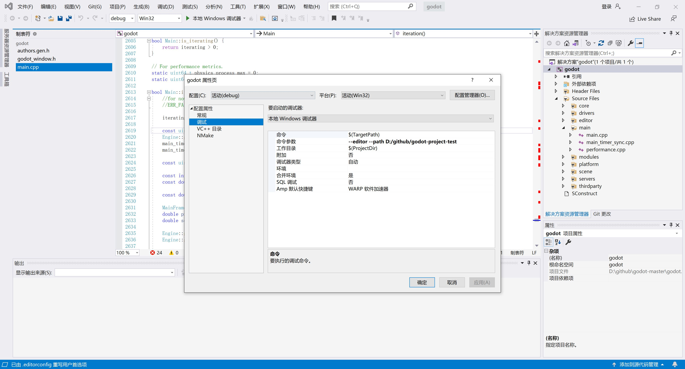

# 工具准备

- git（有科学上网更加好）
```
git下载代码慢的解决方法|无法下载代码的解决方法，使用科学上网
git config --global http.proxy http://127.0.0.1:10809
git config --global https.proxy https://127.0.0.1:10809
```

- python
- SCons，项目的管理工具
- MinGW-w64，主要提供了C++的编译环境（不使用Visual Studio）
- clion

# python

- 官网下载python，选择win64可执行的安装，左下角点击Add Path，自动添加环境变量
- python -v ，查看版本

- pip是python的包管理工具，python自带了pip

```
pip install requests    # 普通安装依赖
pip uninstall requests    # 卸载
pip install -r install.txt  # 从文件中批量安装依赖
pip install requests --proxy="http://127.0.0.1:10809"   # 通过代理下载依赖

pip list    # 已经安装的库
pip install --upgrade requests
```

- pip代理设置
```
# 没有任何配置的情况下，可以通过以下命令设置并自动创建配置文件：
pip config set global.proxy http://127.0.0.1:10809
```

# SCons

- 安装godot的项目依赖管理工具SCons
- pip install SCons --proxy="http://127.0.0.1:10809"
- 在命令行输入scons，看有没有反应，没有安装会提示没有这个命令

# MinGW-w64

- MinGW 的全称是：Minimalist GNU on Windows
- 它实际上是将经典的开源 C语言 编译器 GCC 移植到了 Windows 平台下，并且包含了 Win32API ，因此可以将源代码编译为可在 Windows 中运行的可执行程序
- 还可以使用一些 Windows 不具备的，Linux平台下的开发工具
- 一句话来概括：MinGW 就是 GCC 的 Windows 版本，MinGW-w64 是开源软件，可以免费使用
- https://winlibs.com/ ，选择UCRT runtime下载，解压过后将bin配置在Path环境变量中，如D:\Program\mingw64\bin

```
g++ --version
clang --version
```

# Compile

- 常规编译参数

```
scons -j12 target=debug tools=yes platform=windows bits=64 compiledb=yes use_mingw=yes
scons -j12 target=debug platform=windows use_mingw=yes
scons -j12 platform=windows use_mingw=yes --editor --path D:\github\godot-bird
```

windows 10
clion 2022.2.4

command below:
godot.windows.editor.x86_64.exe --editor --path D:\github\godot-bird

then attach to the godot process

# Android Compile

- 增减一个环境变量，这里使用Android Studio自动下载的SDK，ANDROID_SDK_ROOT=C:\Users\jaysunxiao\AppData\Local\Android\Sdk
- 添加到Path环境变量，%ANDROID_SDK_ROOT%\tools; %ANDROID_SDK_ROOT%\platform-tools;

```
godot.windows.tools.64.exe --editor --path D:/github/godot-project-test

scons -j15 platform=windows use_mingw=yes

scons -j15 platform=android use_mingw=yes target=release android_arch=arm64v8
```

# 使用Visual Studio调试Godot的源代码

- scons platform=windows vsproj=yes

```
使用命令创建vs的解决方案
```

- 再使用Visual Studio双击打开sln解决方案

- 设置调试参数
  

# 使用Clion调试Godot的源代码

- 使用Clion打开项目的文件（根目录）
- Clion会让你选择一个CMake文件，选择platform/android/java/nativeSrcsConfigs/CMakeLists.txt
- 在Terminal控制台使用命令打开godot编辑器，godot.windows.tools.64.exe --editor --path D:/github/godot-project-test
- 然后Attache到godot的process

- [godot C++源代码，编译，打包，调试视频教程](https://www.bilibili.com/video/BV1cU4y1o7ye/)
