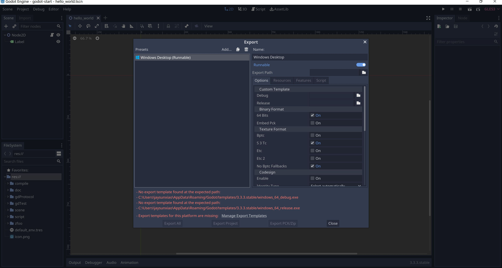
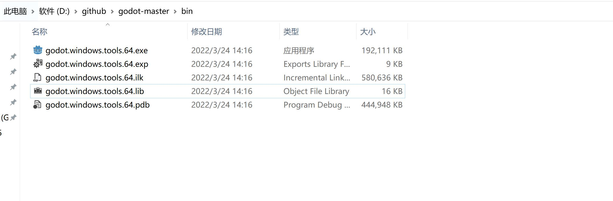

# 工具准备

- python
- SCons，项目的管理工具
- Visual Studio，主要提供了C++的编译环境

# python

- 官网下载python，选择win64可执行的安装，左下角点击Add Path，自动添加环境变量
- python -v ，查看版本

- pip是python的包管理工具，python自带了pip

```
pip install requests    # 普通安装依赖
pip uninstall requests    # 卸载
pip install -r install.txt  # 从文件中批量安装依赖
pip install requests --proxy="http://127.0.0.1:10809"   # 通过代理下载依赖

pip list    # 已经安装的库
pip install --upgrade requests
```

# SCons

- 安装godot的项目依赖管理工具SCons
- pip install SCons --proxy="http://127.0.0.1:10809"

# Visual Studio

- 官网下载Visual Studio 2019，然后选择C++编译工具安装就行
- 如果不想安装VS，那么使用C++编译工具MinGW依然可以


# Compile

- 常规编译参数

```
scons platform=windows                # 默认去寻找VS的编译环境，找不到会寻找MinGW的编译环境
scons platform=windows use_mingw=yes  # 强制使用mingw编译
scons -j6 platform=windows            # 多线程编译
scons platform=windows bits=32        # 软件是64位还是32位置，bits=64 或者 bits=32
```

- 生产版本发布，默认打包是debug+tools，scons platform=windows target=release

```
target=release_debug
target=release          # 生产环境发布，可以加快编译速度和减小包的体积 q q
target=debug
```

- scons -j15 platform=windows target=debug tools=no
  

```
tools编辑器选项，godot里，所有带有tools的，是带编辑器的，不带tools是模板
tools可以在debug、release或者release_debug三种都可以，默认release是不带tools的
完成后，将这个打包好的exe丢到模板目录
%USERPROFILE%AppDataRoamingGodottemplates对应godot版本号
打包的文件叫godot.windows.opt.64，就把这个放入上述目录，对印的opt打包名字就改成windows_64_release
完成后就可以通过export导出项目或者将新增加的内容打包为pck作为dlc使用了
```



- scons -j15 platform=windows target=release tools=no
  

```
opt是optimized production template的缩写，是优化过后的模板，这个打包更加的耗时
```

- scons -j15 platform=windows target=debug tools=yes ，等价于scons -j15 platform=windows
  


- scons -j15 platform=windows target=release tools=yes
  


- 其它编译参数

```
scons platform=windows use_lto=yes              # MinGW的编译环境，使用这个参数可以让发布的体积更加小，但是需要更多的机器内存

scons platform=windows vsproj=yes               # generate the solution
```


godot.windows.tools.64.exe --editor --path C:/godot-start
