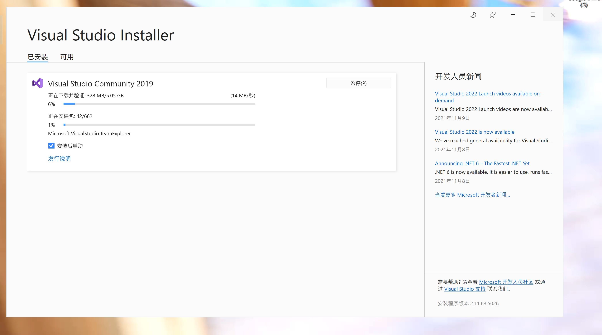

# python

- 官网下载python，选择win64可执行的安装，左下角点击Add Path，自动添加环境变量
- python -v ，查看版本

- pip是python的包管理工具，python自带了pip

```
pip install requests    # 普通安装依赖
pip uninstall requests    # 卸载
pip install -r install.txt  # 从文件中批量安装依赖
pip install requests --proxy="http://127.0.0.1:10809"   # 通过代理下载依赖

pip list    # 已经安装的库
pip install --upgrade requests
```

# SCons

- 安装godot的项目依赖管理工具SCons
- pip install SCons --proxy="http://127.0.0.1:10809"

# Visual Studio

- 官网下载Visual Studio 2019，然后选择C++编译工具安装就行



