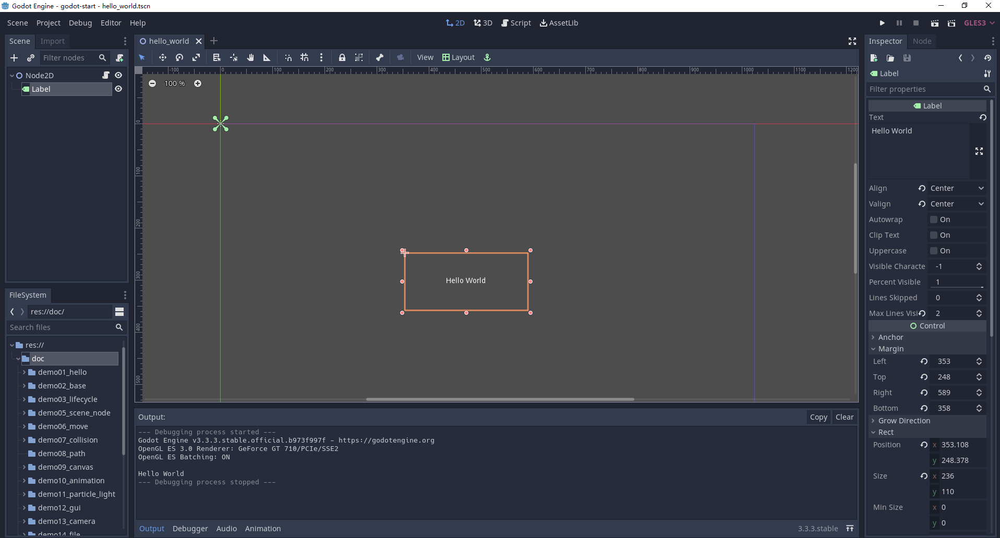
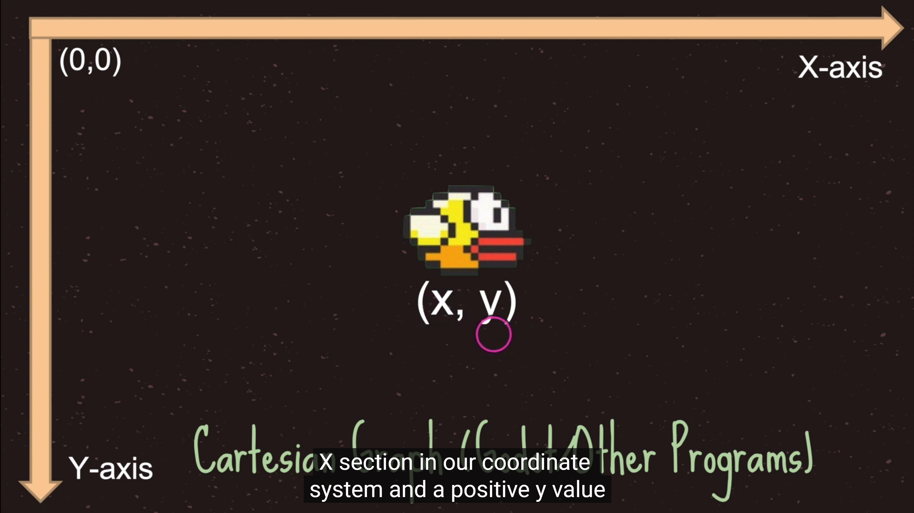

# 1. godot的界面介绍



### 侧面分栏（Dock）

- 点击侧面分栏的右上角可以调整分栏的位置


- 左侧面分栏具体包括：
    1. 文件系统（FileSystem），显示了当前项目中所有的资源文件
    2. 导入（Import），显示了文件系统分栏中所选资源文件的导入设置。
    3. 场景（Scene），按照层级结构显示当前场景中的所有节点，可以简单的理解为一个游戏里的场景/关卡


- 右侧面分栏具体包括：
    1. 属性（Inspector），显示了场景分栏中所选节点的属性。
    2. 节点（Node），显示了与当前场景分栏中所选节点对应的一些“信息”。

### 中间面板：

- 主工作区（Workspace）
    - 2D，当在场景分栏中所选节点为2D类型时，会自动进入此工作区。
    - 3D，当在场景分栏中所选节点为3D类型时，会自动进入此工作区。
    - 脚本（Script），此工作区可以对当前项目中的脚本进行编辑。
    - 资源库（AssetLib），可以搜索并浏览网站上的资源

- 底部面板（Bottom Panel）
    - 隐藏


- 与Unity和UE4不同的是：Godot这种布局关系当前是相对固定的，即它不能随意调整任意一个面板的位置或脱离成独立的窗口。虽然这看似是一个缺点，不过从某种程度上讲也让引擎变得更简单了。

- 如果布局乱了，恢复一下就可以了，Editor | Editor Layout | Default

# 2. 场景和资源

- 场景 Scene ，就是一个游戏里的场景 / 关卡
- 创建场景，在res面板的文件夹下右键，New Scene创建场景
- 资源 Asset，指游戏里用到的素材、脚本等数据文件

```
比如，常用的几种类型:
Texture 图片素材  ( *.jpg /  *.png)
Audio音频素材 ( *.mp3)
程序脚本GdScript ( *.gd)
```

- 可以对素材执行删除 Delete 、重命名 Rename 等操作

# 3. 场景视图和游戏视图

- 场景视图Scene ，即场景编辑器窗口，默认地，创建了一个场景empty

- 鼠标滚轮 ：放大/缩小视图
- 鼠标右键拖拽：平移视图

- 网格，每一个大网格包括8*8的小网格，每个小网格8个像素

```
每一个小格子为：8像素 x 8像素
每一个大格子为：64像素 x 64像素
```

- 场景视图中的蓝色框区域是可见的范围，对应的就是运行游戏的时候的游戏视图

- 本教程所有的每节课都很简单，这是因为对godot的知识做了拆解，把复杂的知识拆解为一个一个简单的知识点
- 然后把每个简单的知识点单独作为一节课，所以整个课程的难度是一种渐进式的
- 复杂的东西都是由一个一个简单的知识构成的，不要觉得课程简单，如果简单的东西不熟练不练习，后面的课程很可能会更不上

# 4. 游戏对象（节点）

- 游戏对象 Node，就是场景中包含的内容，godot所有操作都是基于节点Node

- 演示：向Scene窗口里添加几个图片

```
1 准备图片素材
2 把图片拖到2D游戏场景中
3 在Scene窗口中，观察新加的游戏对象
```

- 游戏对象的简单操作：

```
1 选中游戏对象
从左侧的层次管理器（Scene窗口）中选中游戏对象
2 移动游戏对象
选用移动工具，拖动小方块
3 修改对象名字
在Scene窗口中，可以修改名字、删除对象等操作
```

# 5. 坐标系



- 选择移动工具，移动一个对象
- 可以通过鼠标去移动游戏对象，也可以通过键盘方向键移动游戏对象，也可以手动修改position的坐标x和y去更加精确的移动对象

```
在 Inspector 属性面板：
观察对象的坐标 Position: x,  y
可以发现，对象的坐标会随之变化
```

- 世界坐标系，又称为全局坐标系

```
y轴向下为正
x轴向右为正

一个像素在真实世界中，可以自行约定，比如约定1像素=1米
```

- 相对坐标系，又称为局部坐标系或者本地坐标系，相对于父节点的坐标，godot的坐标都是相对坐标

- 全局坐标和局部坐标可以相互转化

```
Node2D及其子节点的位置可以使用position和gloabl_position来控制，其中，前者是该节点相对于父节点的相对位置，后者是全局位置。
简而言之，position的坐标系是以父节点的位置坐标为原点的坐标系，方向，还是水平向右为x轴正方向，竖直向下为y轴正方向。
需要注意的是，全局位置是以场景的左上角为原点的，并不是以根结点的位置作为原点的
```

# 6. 节点的基础操作

- Q，选择工具，最强大的工具

```
Alt + 拖曳边框缩放点，保持选中目标中心位置不变进行缩放
Shift + 等比列缩放
Ctrl + 鼠标拖曳，以pivot为中心旋转当前对象
```

- W，移动工具，改变 Position

```
Move Mode 对象的移动：
单独改变X坐标
单独改变Y坐标
拖拽中间的方块，可以任意拖动
也可以直接在 Inspector 中输入坐标，会更精确一些
```

- R，旋转工具，改变 Rotation

```
轴心点，又称中心点，是节点的旋转中心

V，移动轴心点，Shift + V 拖拽轴心点

中心点是一个物体的中心，当我们对物体进行操作的时候，都是以中心点为中心进行对物体的操作
轴心点可以理解为把物体抽象成一个点，物体的位置就是指其轴心点的位置，就是该物体坐标系的原点
后面的课程会继续介绍轴心点

Rotate Mode 对象的旋转
沿轴心点旋转
```

- S，缩放工具，改变 Scale

```
Scale Mode 对象的缩放
沿 X 轴缩放
沿 Y 轴缩放
拖拽中间的小方块，X 和 Y 等比例缩放
```

- F，居中选取对象，非常有用的快捷键

# 7. 节点操作的工具，多节点选择，轴心点，平滑，尺子

- 多节点选择工具，show a list，主要用来精确选择层叠在一起的节点
- 轴心点工具，移动轴心点，和选择工具中的快捷键V有同样的作用
- 平滑工具，固定场景
- 尺子工具，量图片或者节点的像素

# 8. 智能对齐Snap和锁定节点

- 智能对齐，Smart Snap
- 网格对齐，Grid Snap
- 锁定节点，使其不能移动
- 子节点不可选中
