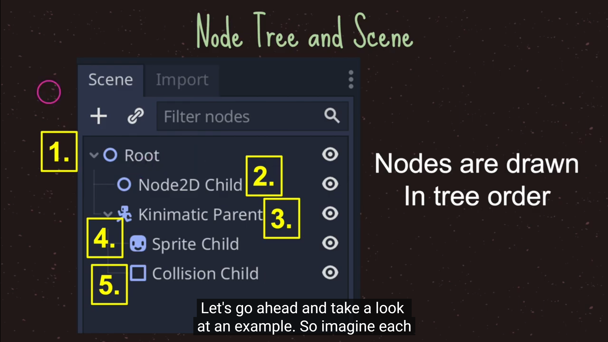
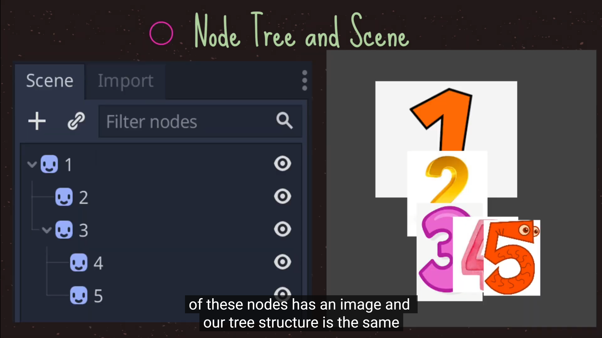

# 1. 节点的父子关系

- 在层级树中，对象 (节点) 呈树形显示，一个节点下面，也可以下挂子节点

- 演示：

```
1 添加两个对象
2 拖拽一个对象到另一个对象，成为子对象 (子节点)
3 移动父对象、旋转父对象，观察

可以发现，当父对象移动时，子对象随之移动
```

- 理解相对坐标

```
子对象的坐标轴，是相对于父对象的
1 移动父对象时，子对象的 Position 不发生变化
2 旋转父对象时，子对象的 Rotation 不发生变化
```

# 2. 节点的显示和隐藏

- 删除游戏对象

```
右键 Delete ，或者键盘 Delete 均可
```

- 恢复

```
CTRL + Z ，撤销上一步操作
```

- 更改节点对象名字

```
右键 Rename，或者双击节点修改
```

- 显示 / 隐藏

```
在 Inspector 里，勾选 Visible 复选框，或者在节点右侧点击Toggle Visibility
```

- 设置长宽比

```
在 Project | Project Settings | Display | Window 中可以设置长宽比
```

# 3. 游戏节点的显示顺序

- 在2D画面中，两个对象如果重叠，谁显示在上面呢？
- 按照节点的顺序
- 在数据结构上的专业术语叫树的广度优先遍历，广度优先遍历的顺序就是最后显示的顺序




# 4. pivot，轴心点

- 轴心点也叫中心点，中心点是一个物体的中心，当我们对物体进行操作的时候，都是以中心点为中心进行对物体的操作
- 轴心点可以理解为把物体抽象成一个点，物体的位置就是指其轴心点的位置，就是该物体坐标系的原点
- **主要用于旋转和决定对象的位置**

- 轴心 Pivot ，指旋转轴、坐标基准点，默认在对象的几何中心

- 轴心的作用：
    - 旋转轴，当旋转对象时，是以 Pivot 为轴心来去旋转对象的
    - 坐标系的原点，当移动对象时，是以 Pivot 为中心来计算位置Position的

- 添加一个图片，设置其 Pivot 位置，多练习一下，不及小步无以至千里

# 5. anchor，锚点

- 是一个点，锚点描述的是一个对象的Margin，相对于锚点的坐标
- 锚点的left，top，right，bottom是相对于父节点的值
- 主要是用于描述子节点相对于父节点的位置
- 当对一个节点的子节点进行设置锚点时，子节点的锚点范围只能够是父节点的控件区域内。
- 注意任何布局也都是相对于父窗口矩形的
- **主要用于在GUI中描述子节点相对于父节点的位置**
- 后面的课程学到GUI中会继续介绍锚点，现在只做了解


