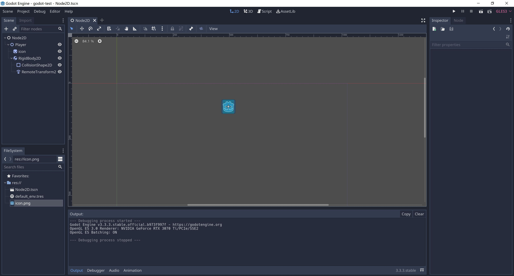
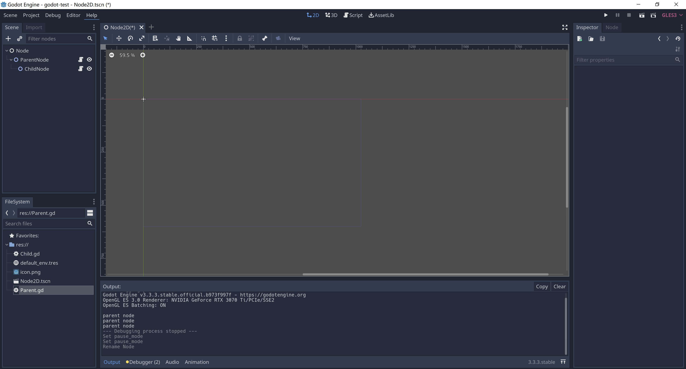

# 1. 节点和功能的关系

- 节点 Node ，用于实现一种功能，例如，Sprite 节点，用于图片的显示
- 一个节点的功能取决于它挂载了哪些子节点，它包含了哪些功能的子节点，就包含了对应子节点表示的功能
- 节点是可选的，可以添加、可以删除


- 先创建一个空的节点，再选择需要的节点



```
Sprite用来显示一张图片，再给Sprite增加一个刚体

演示：
1 添加一个空的节点Node
2 挂载 Sprite 节点，然后再挂载RigidBody2D刚体节点
3 移除RigidBody2D刚体节点
```

# 2. Node节点

- Node节点，是基类节点，所有节点都会继承Node节点，所以其它类型都包含Node节点的功能
- Node节点是最核心的节点，所有其他类型节点都是由Node节点派生出来的



```
1. Pause Mode节点的暂停
get_tree().paused = true
节点的三种可能状态有:

Inherit（继承） ：处理与否取决于父、祖父等等节点中第一个非 Inherit 状态的节点。
Stop（停止） ：无条件停止节点（以及 Inherit 模式的子节点）。暂停时该节点不会进行处理。
Process（处理） ：无条件处理节点（以及 Inherit 模式的子节点）。无论暂停与否，该节点都会进行处理。

process方法执行的优先级，对于子节点依然有效

挂载外部的脚本

```

```
# 脚本初始化会首先调用这个方法，会在_process()方法之前调用
func _ready():
	# get_tree().paused = true
	pass

var count = 0
# 每一帧都会调用这个方法
func _process(delta):
	count = count + 1
	
	if (count % 60 == 0):
		print("parent node")
	pass
```

# 3. CanvasItem节点

- CanvasItem节点，CanvasItem -> Node

- Canvas是画布的意思，所以CanvasItem代表了就是可以被绘制节点，可以设置可视化界面和材质的颜色
- 所有的2D节点和GUI节点都继承于CanvasItem节点
- CanvasItem是按树的树的广度优先遍历顺序绘制的
- 可以通过设置CanvasItem的Show Behind Parent来改变最终渲染到屏幕上的画面顺序

```
Texture 贴图，附加到物体表面的贴图
Material 材质，物体的质地，指色彩，纹理，光滑度，透明度，反射率，折射率，发光度。实际就是Shader
Shader 着色器，使用代码来渲染图形的技术，可以控制GPU运算图像效果的一段代码
```

# 4. Node2D节点

- Node2D节点，Node2d -> CanvasItem -> Node

```
Node2D节点继承于CanvasItem节点，CanvasItem节点继承于Node节点，所以Node2D节点包括了CanvasItem节点和Node节点的所有功能

Transform ，Node2d节点的基本属性，在后面的脚本编程中，Transform属性是最常用的
表示：
 - Position 位置
 - Rotation 旋转
 - Scale 缩放
```  

# 5. 自定义节点

- 当发现现有的节点无法支持新的需求的时候，有两种方法去解决，自定义节点或者自定义脚本，核心都是脚本

- 创建GdScrip脚本，叫MyNode，继承Node2D节点，并自定义节点的icon

```
extends Node2D

class_name MyNode, "res://icon.png"
```  

- 编写脚本，定义变量，编写代码

```
export var a = 1
export var b:String
```

- 保存，如果不保存无法看到我们创建到的节点，这一点需要特别注意

- 添加刚刚创建的自定义节点

# 6. 节点继承

- 通过继承现有节点，来改变已有节点的功能
- 无论是自定义节点还是节点继承，核心都通过脚本控制达到自己想要的效果
- 从下节课开始说GdScript脚本
