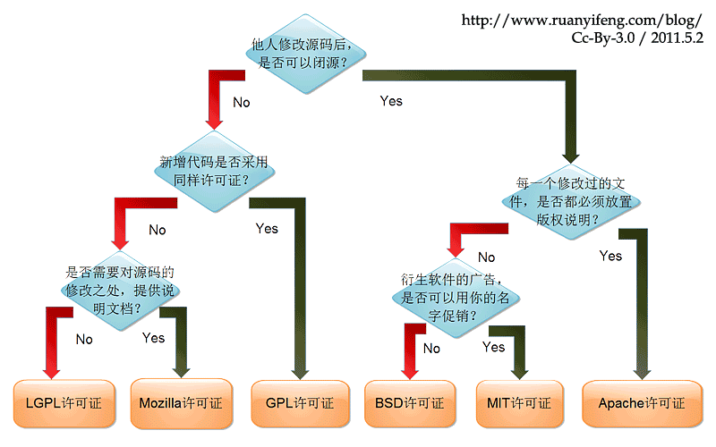

# 为什么选择godot，而不选择unity和ue

- 比unity简单，更加易上手，GDScript学起来也比C#简单

```
大部分使用unity的都在和lua做斗争，虽然unity官方说的是用C#，但是实际上工作用的大部分是lua，C#脚本中的脚本，比如原神就有用到lua
虽然unity可以把C#编译成二进制，但是使用这种方式也就意味着放弃了热更新
这个利弊对于不同项目不一样，需要频繁更新的游戏使用脚本语言更加友好，不需要频繁更新的完全使用C#也可以

现在需要频繁更新的功能，比如活动，在王者荣耀中这些活动大部分都是用h5页面去做了，这个只需要JavaScript就可以了，比较完美和超前的解决方案

GDScript兼顾性能的同时，还带来比较简洁的语法，还可以热更新，只需要用一个语言，理论上远远比unity简单
```

- 源代码开源，不收费，unity和ue都是要收费的，ue超过100万美元触发5%的分成费用
  
  

- godot的源代码比cocos的源代码少一倍，简介的代码更容易学习底层原理

```
godot的作者尽最大努力的减少第三方库的依赖，最终使其代码非常精简，适合学习
unity和ue安装后都得1g以上，godot下载包50m就搞定了，而且不用安装
ue虽然开源源代码，但是代码量太大，历史包袱太重，不适合深入研究底层代码的人 
```


- 自主可控(避免被“卡脖子”)，从开源软件的角度分析，godot是游戏引擎界的Linux，自己能够本地编译godot源代码，成就感爆棚

```
使用godot你既可以用GDScript去编写代码，也可以用C++去编写代码，还可以去改底层引擎代码
游戏行业到最后都是C++，如果想把游戏当作自己的事业，那绝对不要满足在脚本上，游戏最后的优化都是基于硬件显卡之上的，只能用C++
```

- 用godot你能感觉我能把控底层，我能把控每一行代码的底层细节，这个是程序员的浪漫，godot在国外比较火是有原因的

# 为使用godot我应该选择什么语言，C# or GDScript

- GDScript比python和lua更加简单
- 快速加载无需编译，无任何等待
- 有内置的高性能类型入Vector，更加有效率
- 多线程支持更加友好，其它脚本多线程支持很差
- 直接由godot内置引擎解析
- gd没有gc，没有垃圾回收器，C#带GC垃圾回收器的语言虽然也是内存安全的，但由于GC的存在，已与底层无缘
- gds更加简单，支持的更加完整，而且是脚本可以热更新
- C#很多库用不了，有限制，如果是为了性能可以在godot中使用C++
- unity在很久之前也同时支持过js和C#，最后放弃了js，主要是因为unity是mono和C#非常友好
- 通过学习gds也可以学到一些编译原理的知识
- godot不仅仅是一个游戏引擎，而且还是一个优质的学习资源
- C#对于godot来说比较重，推荐gds

### 参考资料

- [为什么unity愿意用c#作为代码语言,而虚幻却使用c++？](https://www.zhihu.com/question/393440831)
