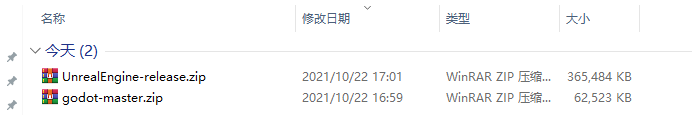
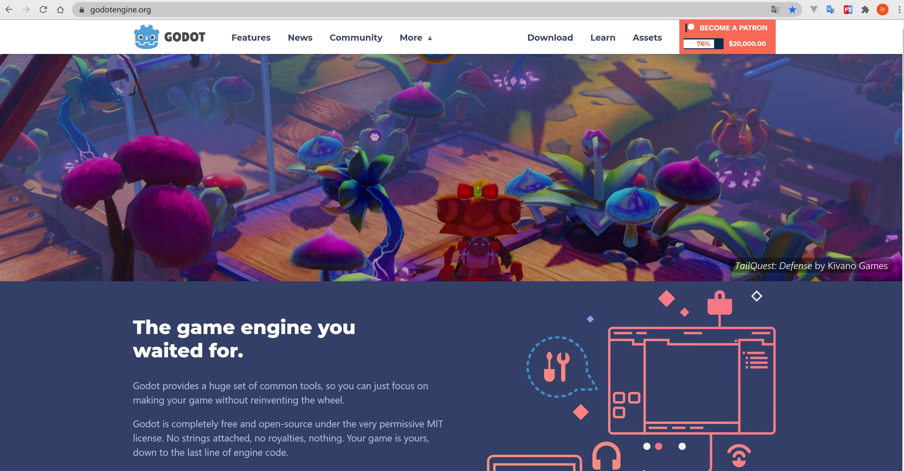

# 为什么选择godot，而不选择cocos, unity, ue

- godot比cocos, unity, ue简单，更加易上手


- godot和cocos对比
  - godot的源代码比cocos的源代码少一倍，所以godot源代码更加的简洁，简洁的代码更容易学习底层原理
  - cocos主要都用在2D方面，2D方面godot支持的更加全面
  - GDScript比JavaScript更加简单，因为GDScript是定制过后的语言


- godot和unity对比
  - unity代码不开源，但是即使开源unity的源代码体积绝对大于godot一倍以上
  - godot安装包50M，unity安装几个g
  - 目前2d方面godot优于unity，3d方面unity优于godot，godot4.0有望大大缩小和unity的差距
  - GDScript学起来也比unity的C#和Lua简单
  ```
  大部分使用unity的开发人员都在使用Lua做开发，虽然unity官方说的是用C#，但是C#不能热更新，所以实际上工作用的大部分使用的是能够热更新的Lua
  比如原神就有用到Lua来去做热更新
  
  现在需要频繁更新的功能，比如活动，在王者荣耀中这些活动大部分都是用h5页面去做了，这个只需要JavaScript就可以了，比较完美和超前的解决方案
  所以unity的语言比较杂，用C#，Lua，Javascript都有可能
  
  GDScript兼顾性能的同时，还带来比较简洁的语法，还可以热更新。
  因为godot只需要用一个GDScript语言，所以远远比unity简单
  ```

- godot和ue对比
    - 自主可控(避免被“卡脖子”)，从开源软件的角度分析，godot是游戏引擎界的Linux，ue和unity算是Windows
    - ue虽然开源源代码，但是代码量太大，历史包袱太重，不适合深入研究底层代码的人
      


- godot的作者尽最大努力的减少第三方库的依赖，最终使其代码非常精简，适合学习
- 源代码开源，不收费，unity和ue都是要收费的，ue超过100万美元触发5%的分成费用
  
  


- 使用godot你既可以用GDScript去编写代码，也可以用C++去编写代码，还可以去改底层引擎代码
- 用godot你能感觉我能把控底层，我能把控每一行代码的底层细节，这个是程序员的浪漫，godot在国外比较火是有原因的

# 为使用godot我应该选择什么语言，C# or GDScript

- GDScript快速加载无需编译，无任何等待
- GDScript有内置的高性能类型入Vector，更加有效率
- GDScript多线程支持更加友好，其它脚本多线程支持很差
- GDScript直接由godot内置引擎解析
- GDScript没有gc，没有垃圾回收器，C#带GC垃圾回收器的语言虽然也是内存安全的，但由于GC的存在，已与底层无缘
- gds更加简单，支持的更加完整，而且是脚本可以热更新
- C#很多库用不了，有限制，如果是为了性能可以在godot中使用C++
- 通过学习GDScript也可以学到一些编译原理的知识
- godot不仅仅是一个游戏引擎，而且还是一个优质的学习资源
- C#对于godot来说比较重，推荐gds

### 参考资料

- [为什么unity愿意用c#作为代码语言,而虚幻却使用c++？](https://www.zhihu.com/question/393440831)
