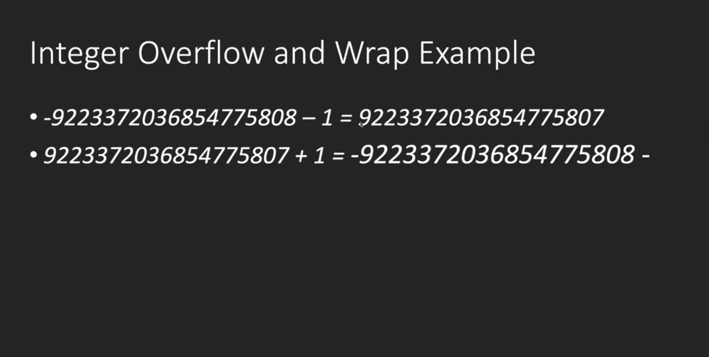

- 参考资料
- [godot官方文档](https://docs.godotengine.org/en/stable/getting_started/scripting/gdscript/gdscript_basics.html)
- [Godot Tutorials的youtube播放量最高的godot教程视频](https://www.youtube.com/watch?v=JJQa3xrRNM0&list=PLJ690cxlZTgL4i3sjTPRQTyrJ5TTkYJ2_)
- [B站视频](https://www.bilibili.com/video/BV17g4y1z7uS)

# 数据类型

