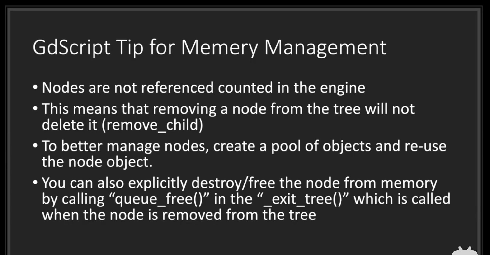
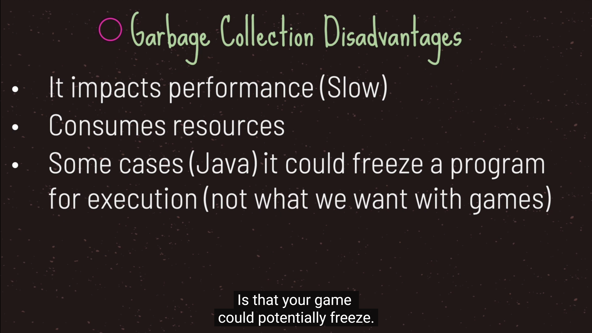
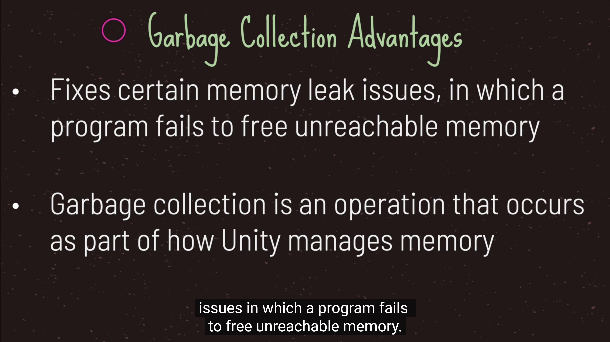
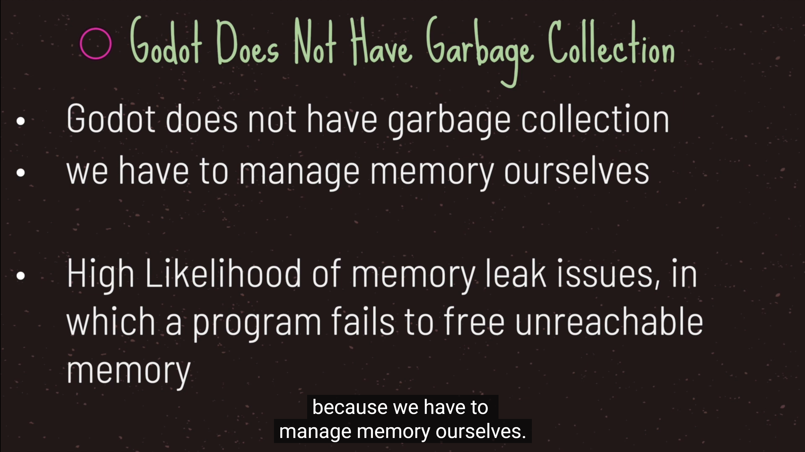
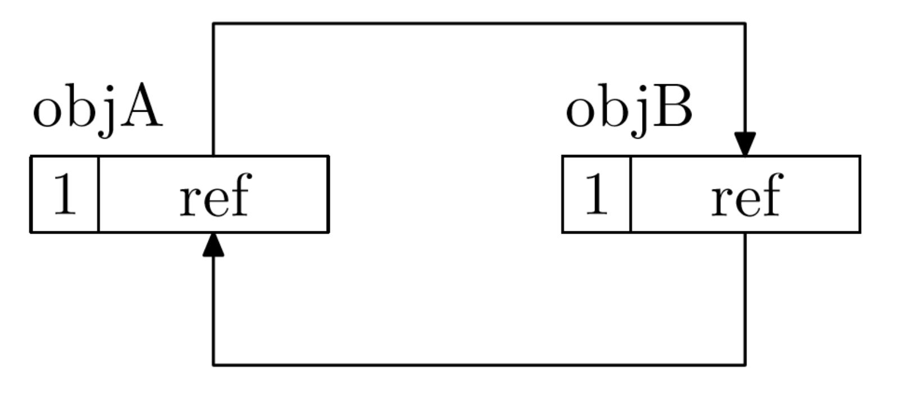

# 1. 内存管理free

- godot中的对象分为两种
    - 引用计数对象，继承于Reference，当没有引用时会被自动回收
    - 非引用计数对象，没有继承于Reference，自能自己手动回收,free或queue_free

- 在godot中，移除一个节点并不会从节点中删除，必须手动调用free或queue_free

# 2. 垃圾回收的缺点

- GdScript没有垃圾回收，虽然有着内存泄露的风险，但是也保证了性能

# 3. 引用计数算法

- 对于创建的每一个对象都有一个与之关联的计数器，这个计数器记录着该对象被使用的次数
- 可以立即回收垃圾。因为每个对象在被引用次数为0的时候，是立即就可以知道的。
- 没有暂停时间。这个很容易理解，对象的回收根本不需要另外的GC线程专门去做，业务线程自己就搞定了。
- 不需要stop the world，当然，在多线程的情况下，必要的同步和互斥操作还是需要的。

- 一个致命缺陷是循环引用，就是， objA引用了objB，objB也引用了objA。这种情况下，这两个对象是不能被回收的。
  

- 可以使用unreference去释放引用计数的对象

- 引用计数既保留了性能，也保证了更加高效的性能
  
