# 1. 场景树

- Nodes（节点）是在Godot中创建游戏的基本构建块。当一组节点被添加到树中时，它被称为sence（场景），树被称为sence tree（场景树）

```
节点是可以表示各种专用游戏功能的对象。给定类型的节点可以显示图形，播放动画或表示对象的3D模型。
该节点还包含一组属性，允许你自定义其行为。
你添加到项目中的节点取决于你需要的功能。
它是一个模块化系统，旨在为你提供构建游戏对象的灵活性。

在项目中，你添加的节点将组织为树结构。在树中，节点被添加为其他节点的子节点。
特定节点可以具有任意数量的子节点，但只能有一个父节点。
```

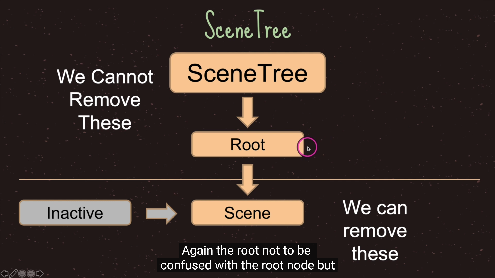

# 2. 帧率

- 帧率 Framerate ，指画面每秒更新多少次 (FPS, Frames Per Second)

```
比如，
  FPS = 50 , 即每 20ms 秒更新一次
  FPS = 60,  约 16.7ms 秒更新一次

通过代码可以设置，要求 godot 引擎尽量以此帧率运行 ，但实际帧率还是会有偏差
Engine.target_fps = 120
```

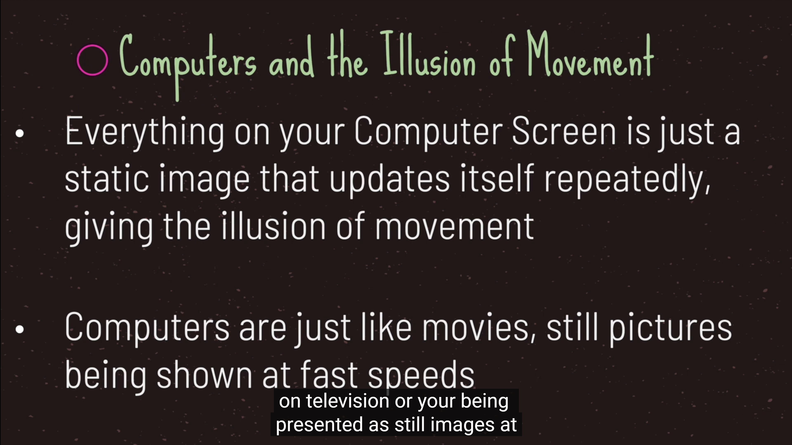
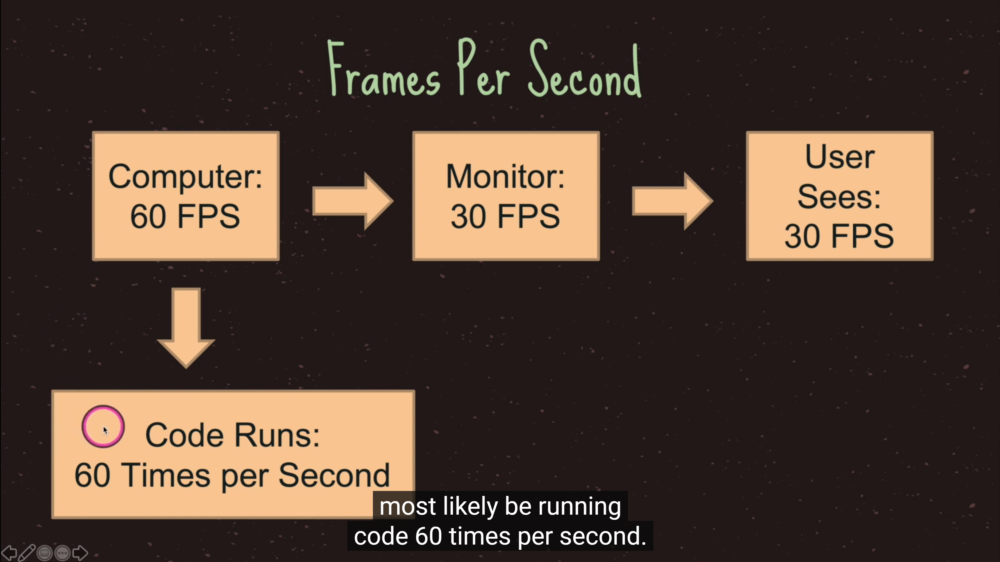

- delta time上一帧的间隔

```
匀速移动的优化：
 var step = 0.8f * deltaTime;
其中，
   0.8f  表示每秒位移 0.8 单位
```

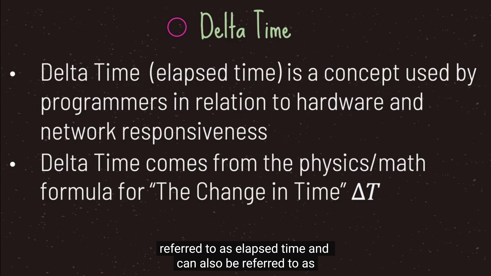
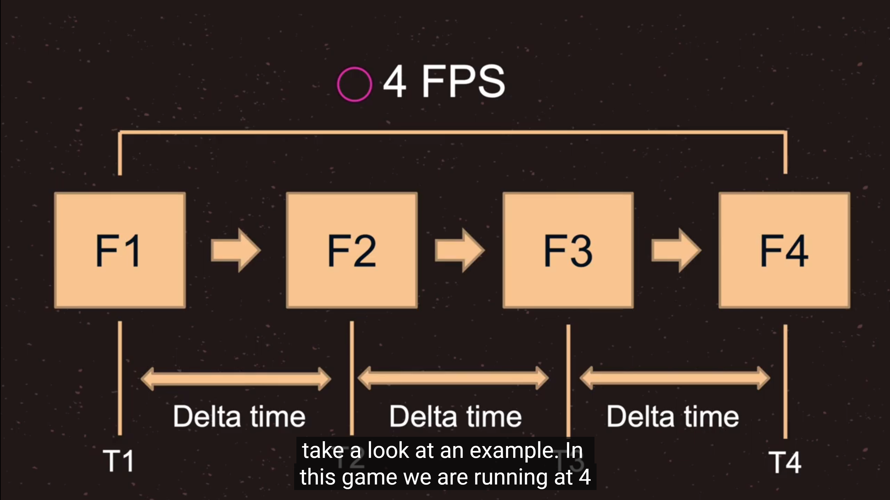

# 3. 节点的生命周期

- 在Godot中，一个游戏的启动大致流程如下：

```
Godot的main启动一个进程，加载所需的驱动设备（如渲染设备：GL/GLES/Vulkan等）、音频设备，输入控制器设备等等；

然后进入主循环，加载一个自动创建的对象——SceneTree（场景管理系统对象，它用户管理场景图），
这个对象包含一个RootViewPort节点（它是一个Node），该节点包含一个默认的ViewPort（以便提供默认渲染的输出视口）。

当用户用Godot编辑器创建一个关卡（或场景文件），并设置默认的启动的场景文件，Godot将该场景文件的根节点附加到RootViewPort节点上，
当节点进入场景树（SceneTree），变为活动状态。
按场景树顺序依次回调各个子节点的_init()，_ready()等声明函数。
```


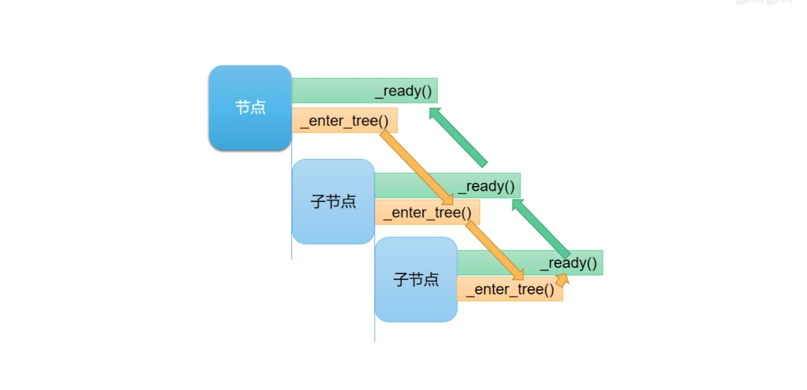


# 4. 节点的获取方式

```
# 获取当前节点
var currentNode1 = $"."
var currentNode2 = self

# 获取父节点
var parentNode1 = get_parent()
var parentNode2 = $"../"

# 获取子节点
var subNode1 = $SubNode2
var subNode2 = $"SubNode2"
var subNode3 = get_node("SubNode2")

# 根节点查找法，会返回节点树从上到下找到的第一个节点
var subNode4 = get_tree().root.find_node("SubNode2", true, false)
```

# 5. process和physics_process

- 平时我们看到的动画，实际上是由很多静止的画面连续切换组成的
- 其中每个静止的画面，我们都称为一帧，比如60帧的动画，就是一秒播放60个静止的画面，组成的动画
- godot 的 _process 相当于 unity 的 Update

```
内部对代码就会在每一帧之前被执行，也就是引擎每渲染一幅的画面之前，都会执行它里面的代码
```

- godot 的 _physics_process 相当于 unity 的 FixedUpdate

```
内部的代码会在每个物理帧之前被执行，
因为godot的物理模拟是单独进行的，每次进行物理模拟的时候，如计算一个刚体小球的运动轨迹，每进行一次计算，我们就称为是一进行了一个物理帧，
而每次进行物理模拟之前，都会执行_physics_process中的代码
```

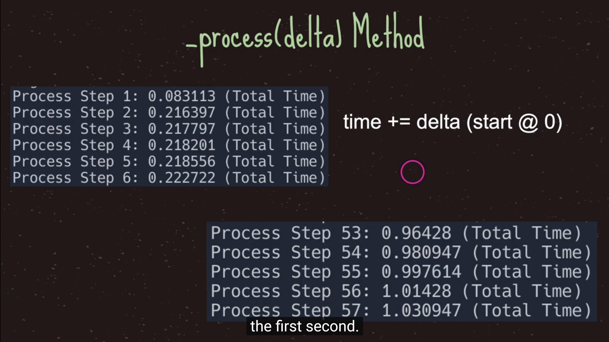
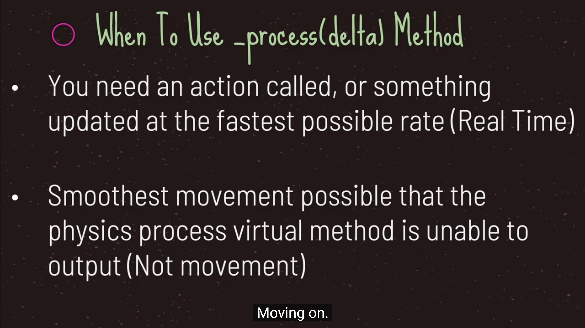
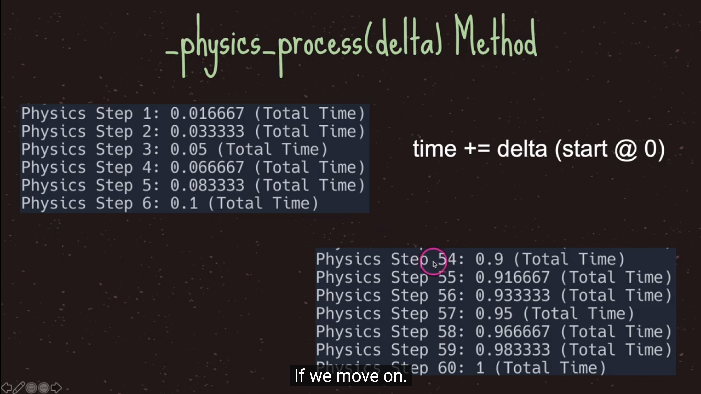
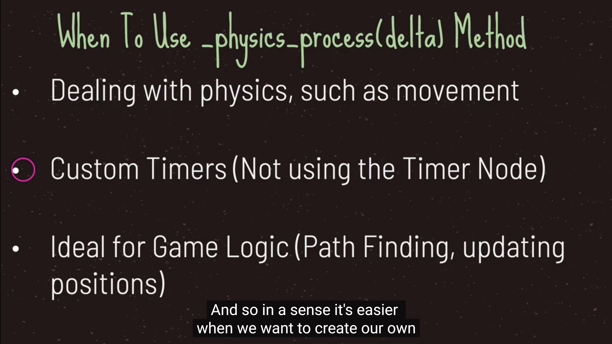

# 6. Parent和Owner

- Parent
    - 一个节点的Parent就是场景树上它的父级

- Owner
    - 如果不修改默认Owner的话，可以把它视为节点所在场景的顶部节点，如果该节点本身就是顶部节点那么它的Owner为null


- 静态场景结构中默认的Owner

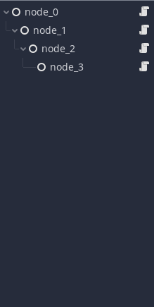

```
extends Node

class_name TestNode

func _ready():
	var parent_name = "NULL"
	var owner_name = "NULL"
	if get_parent() != null:
		parent_name = get_parent().name
	if owner != null:
		owner_name = owner.name
	print(name + "'s parent is <" + parent_name + "> and it's owner is <" + owner_name + ">" )
	
```

```
node_3's parent is <node_2> and it's owner is <node_0>
node_2's parent is <node_1> and it's owner is <node_0>
node_1's parent is <node_0> and it's owner is <node_0>
node_0's parent is <root> and it's owner is <NULL>
```

- 动态创建的节点的Owner是null