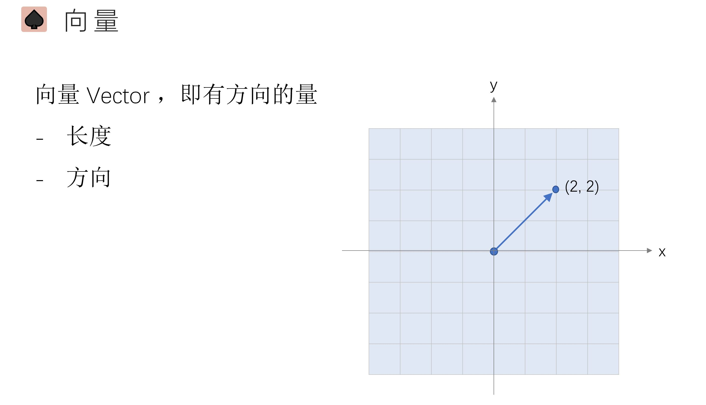
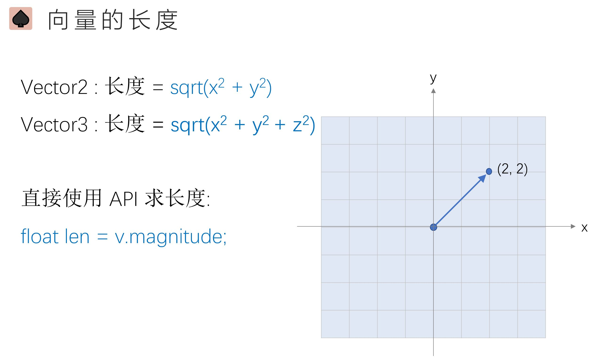
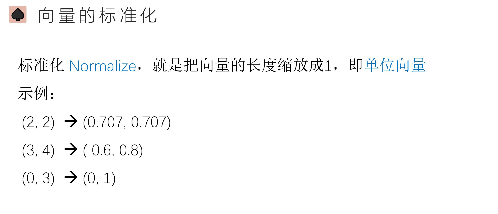
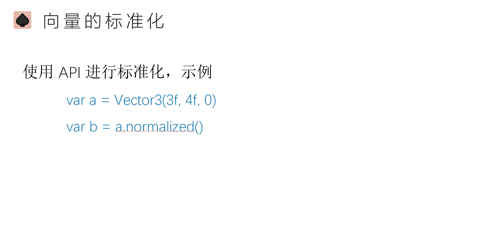
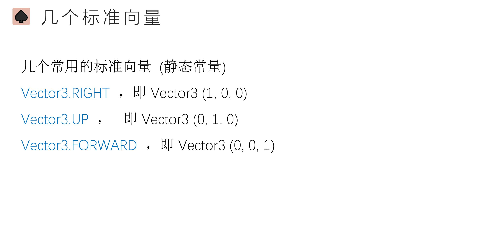
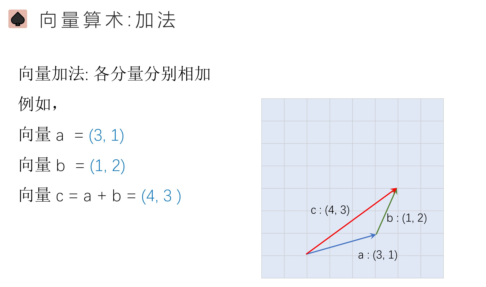
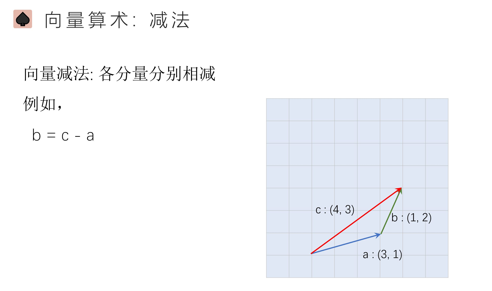
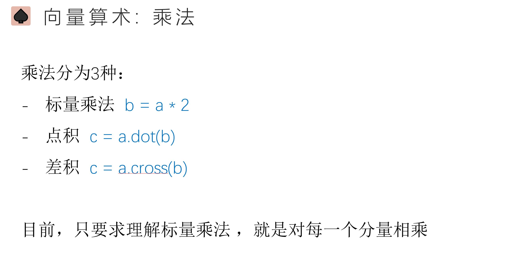
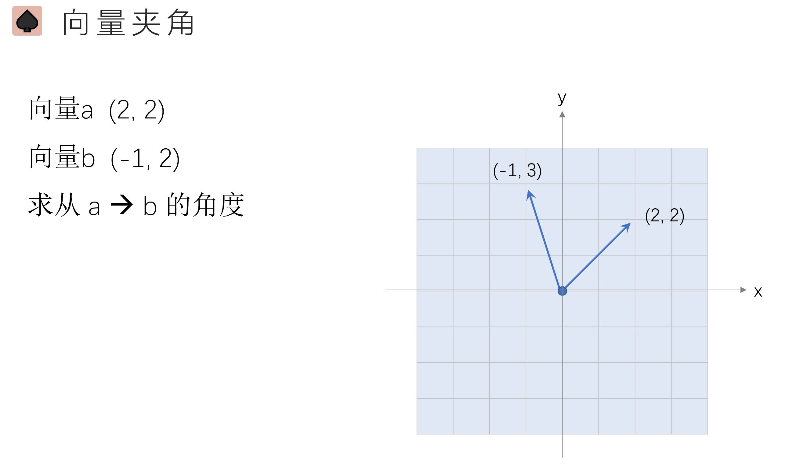
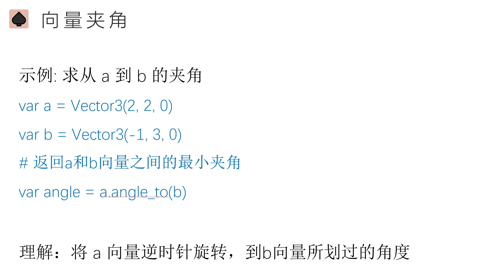

# 1. 向量的基础

- a·b=||a||||b||cosθ, 这个是向量的内积，又叫数量积，又叫点积。
- axb = ||a||||b||sinθ，这个是向量的外积，又叫向量积，又叫叉积。

# 2. 通过输入事件来控制物体移动

- 事件系统是游戏开发过程中需要涉及到交互常用的功能。
- 使用事件系统不仅可以将输入行为（例如：键盘、鼠标、触摸）以事件的形式发送到应用程序
- 也可以将游戏过程中的发生的，需要其他对象关注的事情通过事件的形式回应。例如：游戏胜利后需要打开结算或者奖励界面。

