- sprite

```
上世纪70年代，在德州电器公司，一个叫Daniel Hillis的前辈最早把Sprite这个词用在计算机图形上，在展示界面上，
有一些东西在实现层面并不是和整个画面融为一体的，而是『漂浮』在其他画面之上，像『幽灵』一样，所以被称为Sprite。

一张一张的图片组成了一个会动的精灵
```

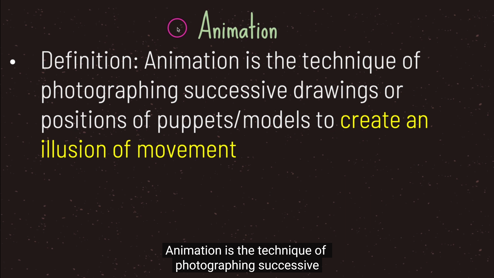
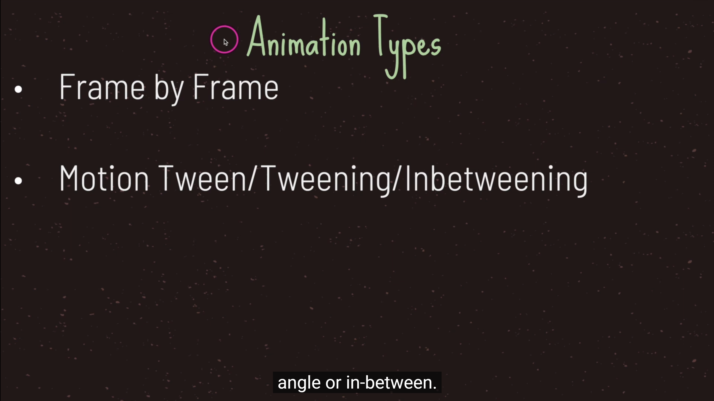
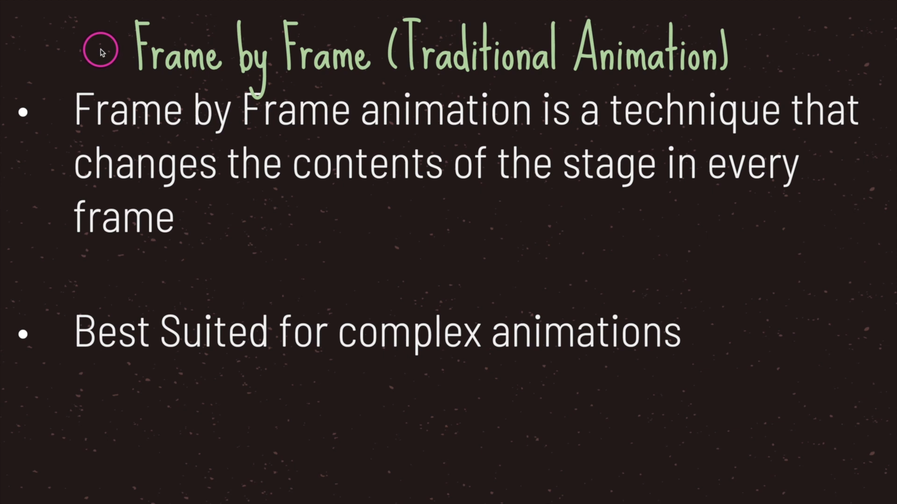
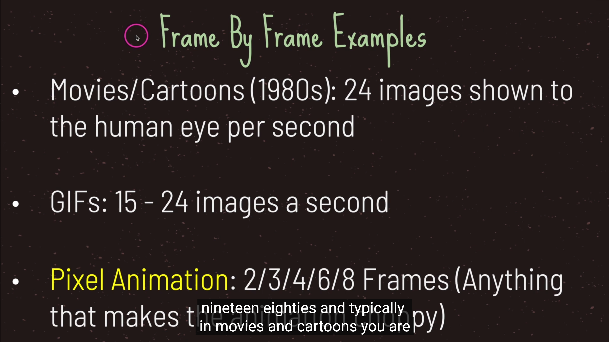
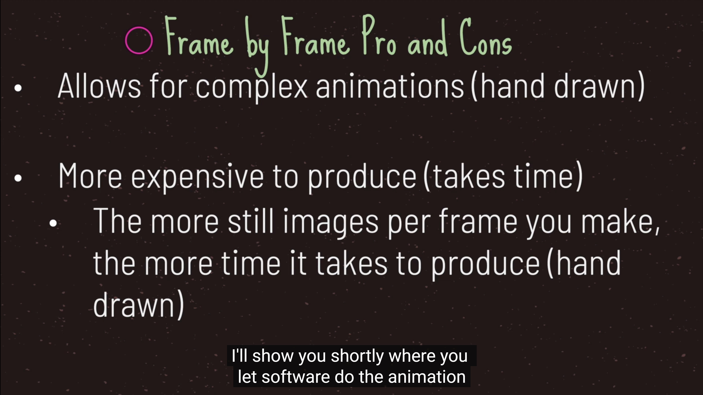
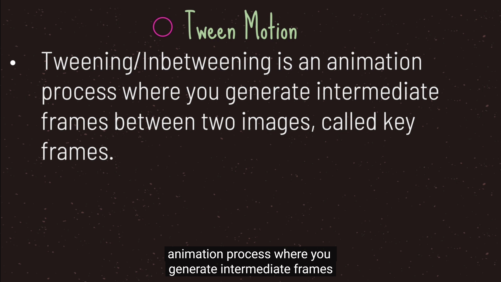
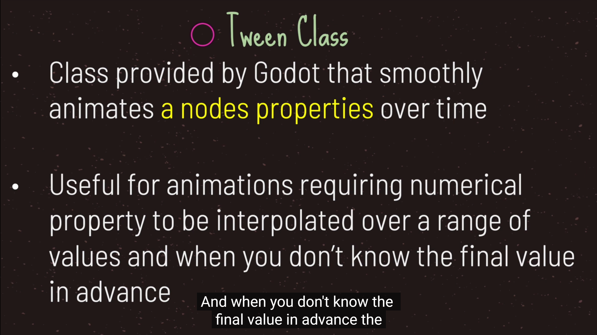
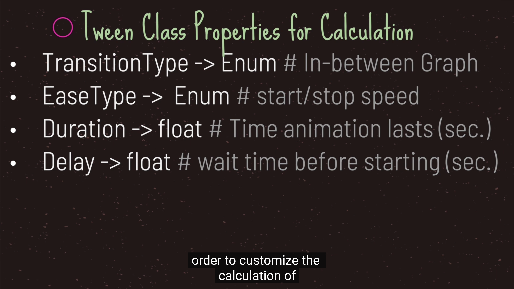
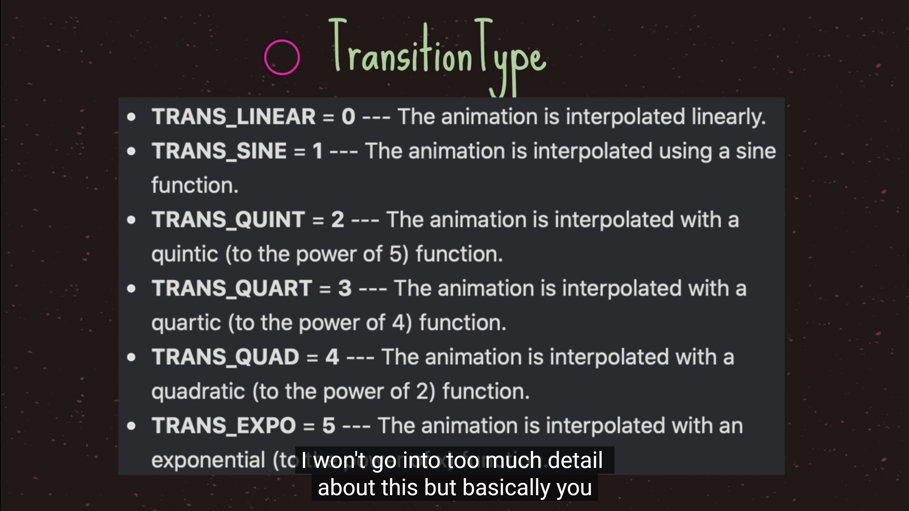
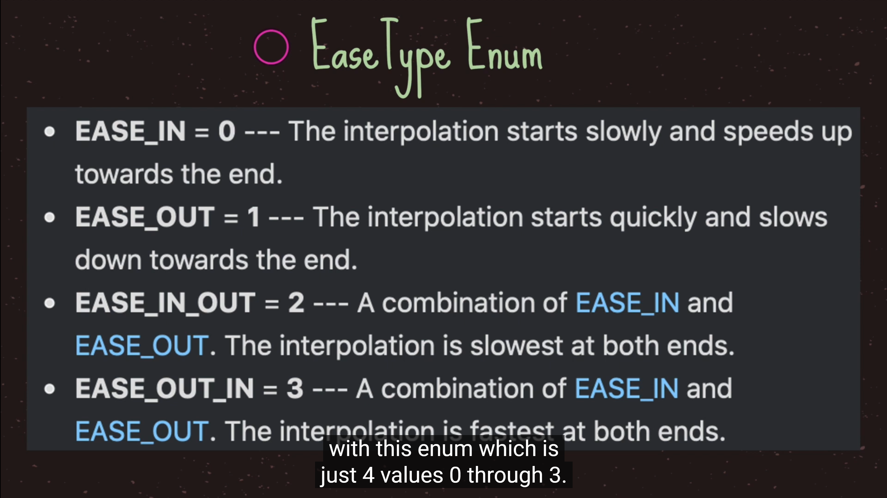
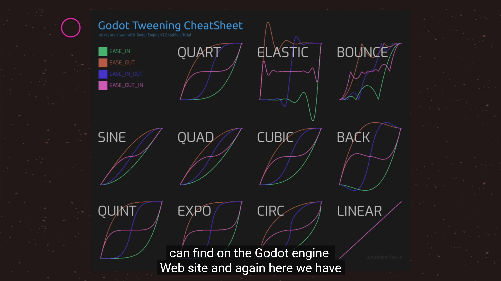
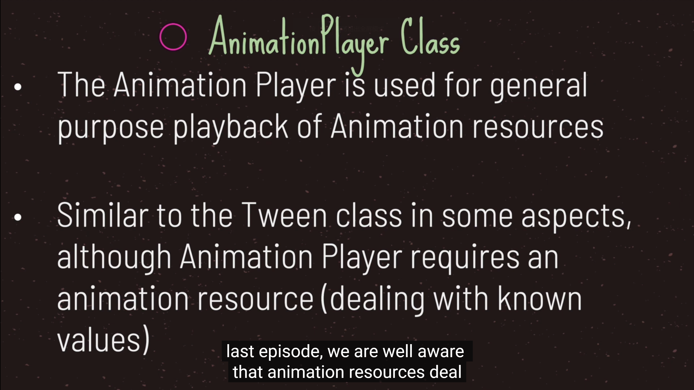

- AnimationPlayer是时间和属性的变化，是一种动画的表现
- AnimatedSprite是序列帧的简便的用法

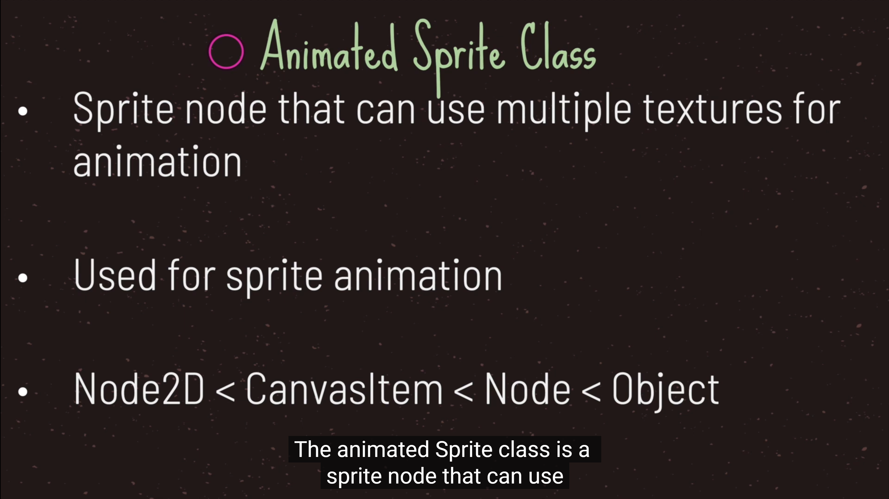
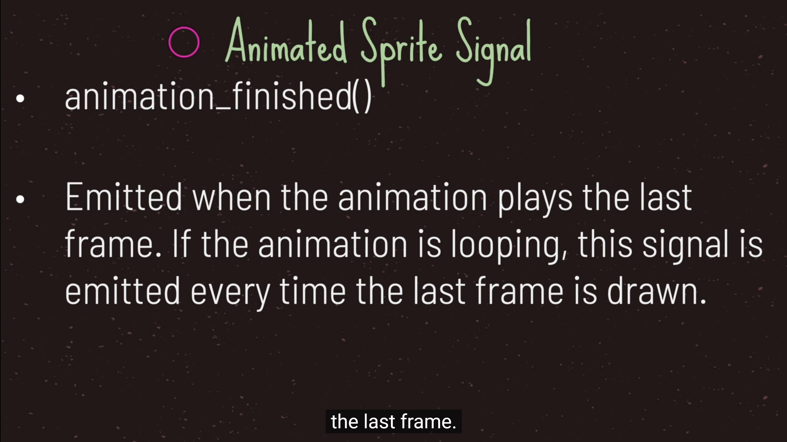
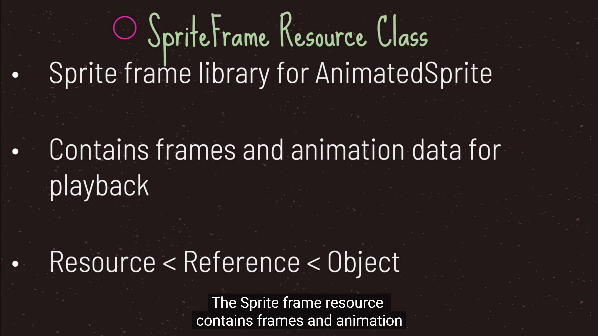
