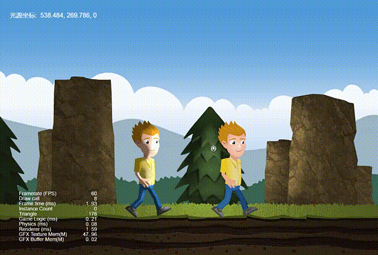
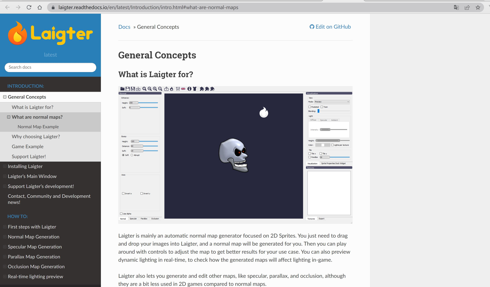
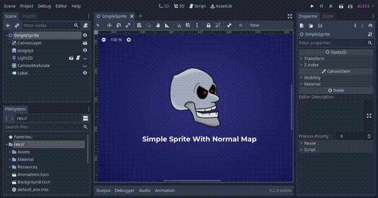
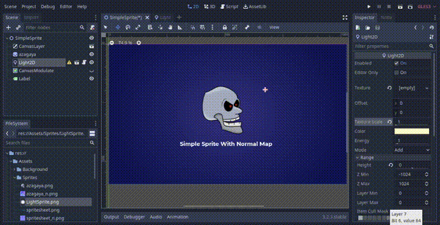
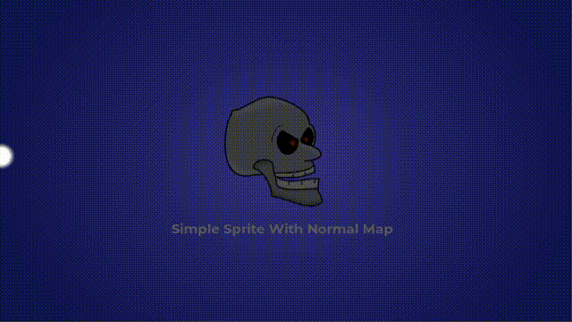
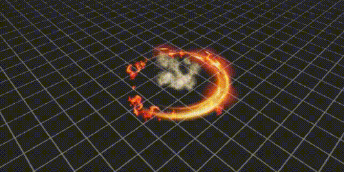

# 1. 光照系统Light2D

- godot 的 2D 动态光照
- 首先看看 Demo 的预览效果。可以看到，当我们在 Demo 中移动光源的位置，小人和场景也会随之表现出不同光照的情景



- 带法线贴图的Sprite和普通的 Sprite 有什么区别呢? 通过对比不难看出它们的差别主要是集中在材质上面。小人使用了自定义的 mat_normal 材质

# 2. 法线贴图NormalMap

- 在godot4中需要在Sprite2D中选择CanvasTexture才能够看到法线贴图
- 法线贴图的定义

```
法线贴图就是在原物体的凹凸表面的每个点上均作法线，通过RGB颜色通道来标记法线的方向，
你可以把它理解成与原凹凸表面平行的另一个不同的表面，但实际上它又只是一个光滑的平面。
对于视觉效果而言，它的效率比原有的凹凸表面更高，若在特定位置上应用光源，可以让细节程度较低的表面生成高细节程度的精确光照方向和反射效果。
```


```
在物理世界中，我们看到的物体的颜色，其实是物体本身反射光线的颜色，因为物体的材质不同，会吸收部分不同的颜色分量而导致我们看到的物体颜色不同。

模拟光照的过程实际上就是模拟整个光的传播过程。
```

- 需要注意的是，法线贴图在3D游戏中运用的更多一点，2D稍微少很多

- 法线贴图的制作软件[laigter](https://github.com/azagaya/laigter)



- godot中使用法线贴图非常的简单





# 3. 光照和阴影LightOccluder2D

- 光照是指光的照射，godot 中光照的实现模拟了光对真实世界的影响。在场景中添加光源可以使场景产生相应的光照和阴影效果，获得更好的视觉效果。
- 在godot4中，光线分为两个，点光源PointLight2D和全局光源DirectionalLight2D


# 4. 粒子系统



- 粒子系统是游戏引擎特效表现的基础，它可以用于模拟的火、烟、水、云、雪、落叶等自然现象，也可用于模拟发光轨迹、速度线等抽象视觉效果。

```
中大型游戏中，几乎没有哪个游戏不使用粒子特效的。
掌握粒子系统对游戏开发极其重要，合理地使用粒子特效对游戏效果绝对是锦上添花、如虎添翼。
常见的粒子特效有：烟花、灰尘、火焰、爆炸、光环、雪花、雨滴、溅射等等等等。比如下面的这张非常熟悉的效果图，使用的就是粒子特效：
```


