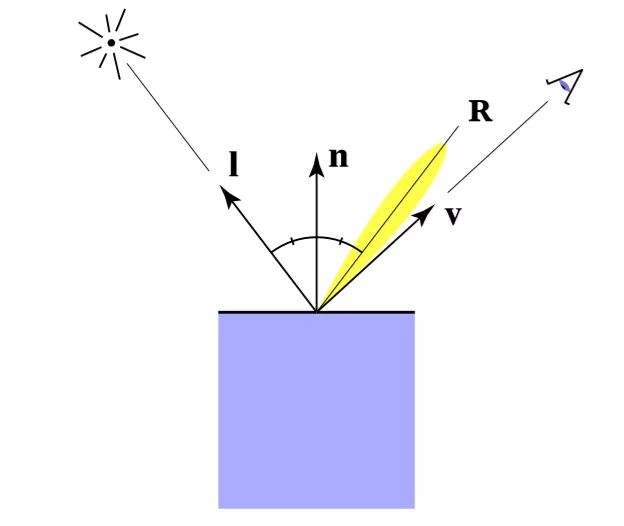

# 1. 光照系统

- godot 的 2D 动态光照
- 首先看看 Demo 的预览效果。可以看到，当我们在 Demo 中移动光源的位置，小人和场景也会随之表现出不同光照的情景


- 那么它和普通的 Sprite 有什么区别呢? 通过对比不难看出它们的差别主要是集中在材质上面。小人使用了自定义的 mat_normal 材质


```
在物理世界中，我们看到的物体的颜色，其实是物体本身反射光线的颜色，因为物体的材质不同，会吸收部分不同的颜色分量而导致我们看到的物体颜色不同。

模拟光照的过程实际上就是模拟整个光的传播过程。
```

# 2. 粒子系统


