- godot默认不显示中文，需要下载中文的字体
- 字体，https://github.com/adobe-fonts/source-han-sans/releases
```
思源黑体
由Google和Adobe在2014年7月正式推出的开源字体不仅可以免费商用而且全面支持中文简体、中文繁体（香港）、中文繁体（台湾）、日文和韩文，还有七种字体粗细，整个字形个数接近50万。

免费可商用
```

# controller
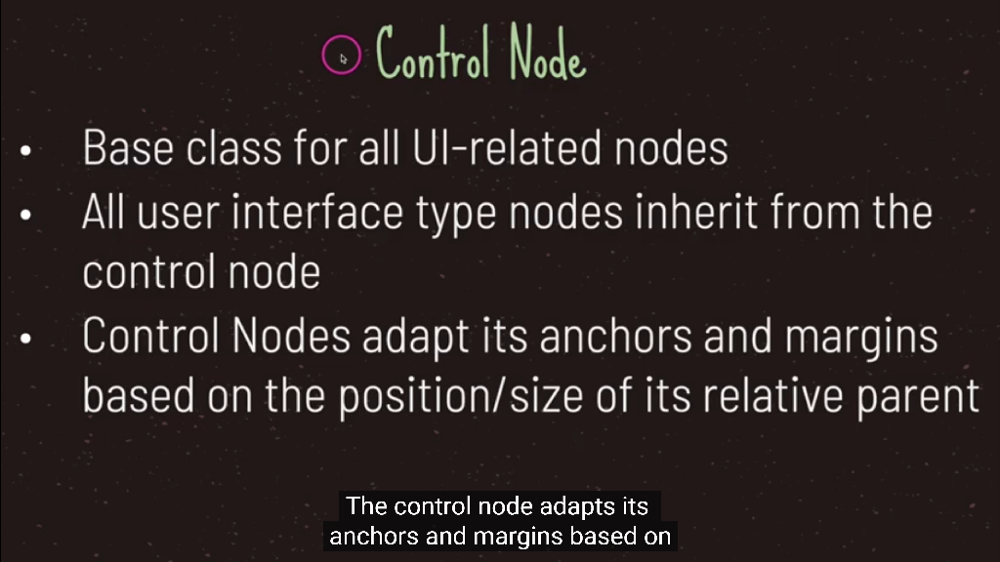

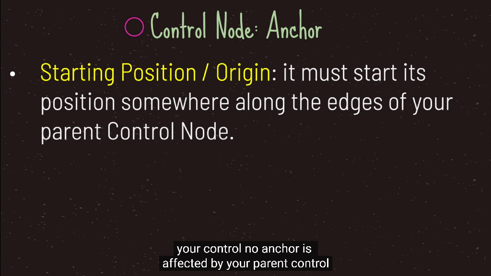
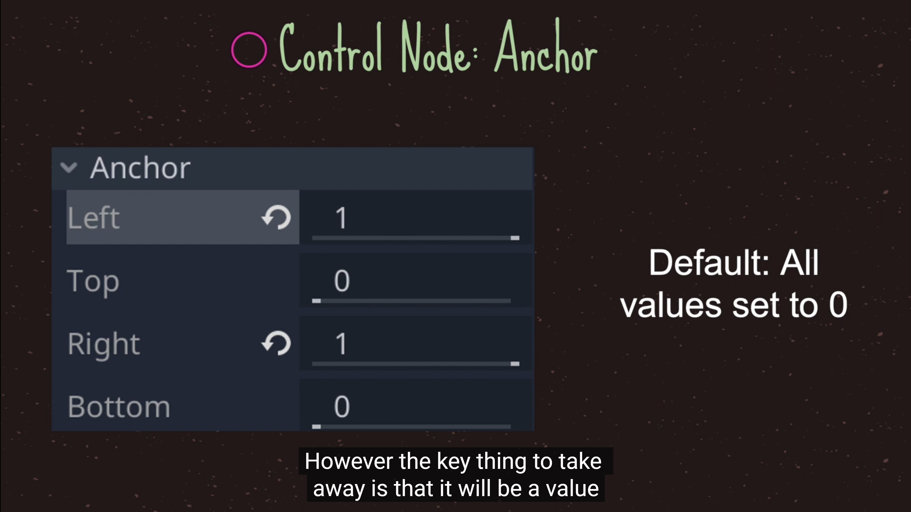
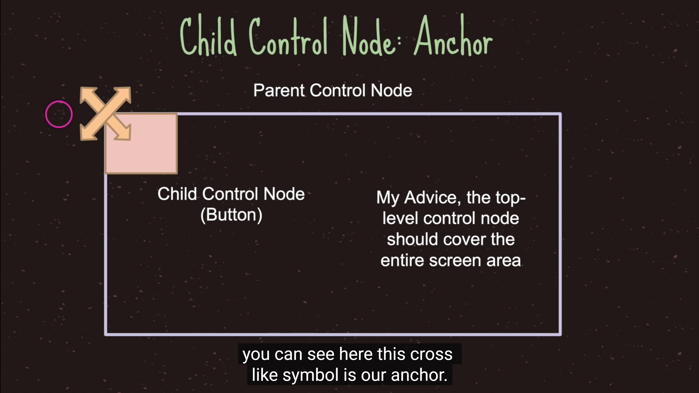
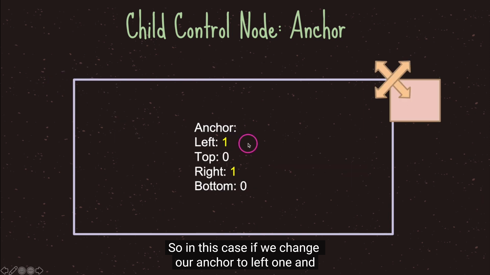
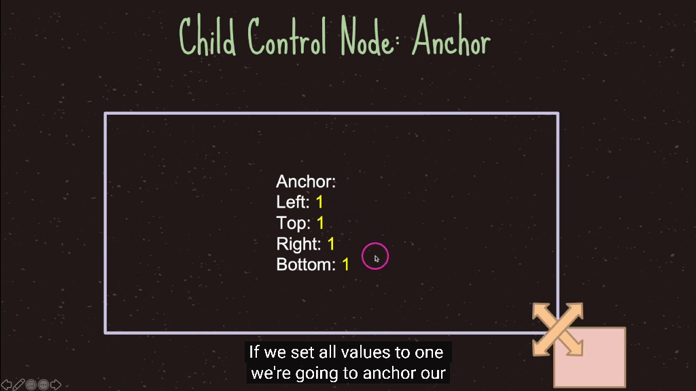
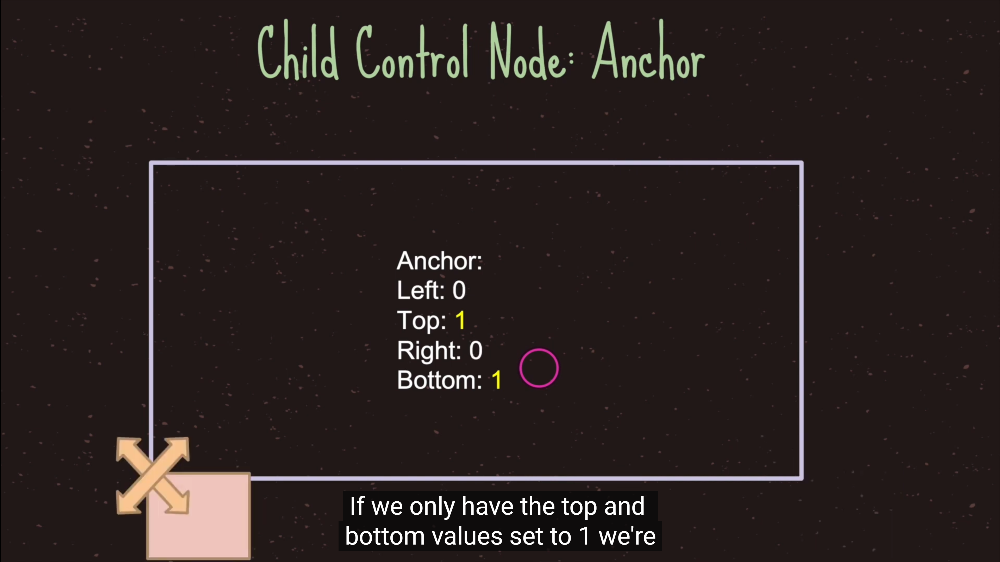
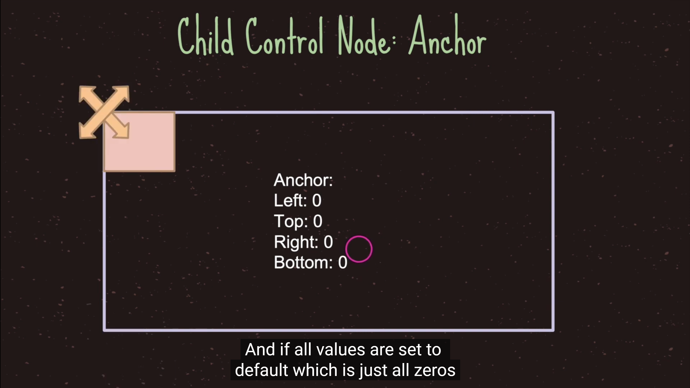
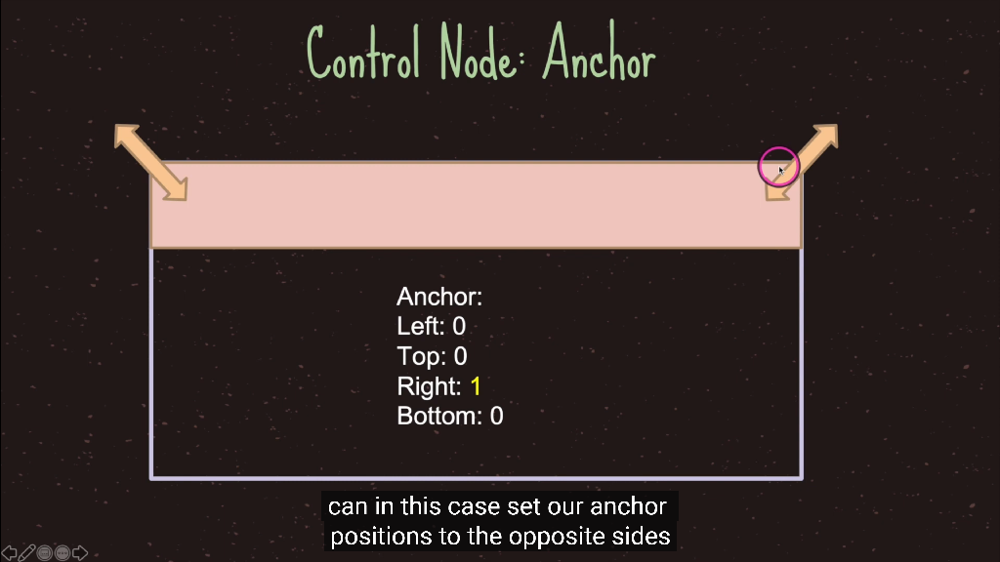
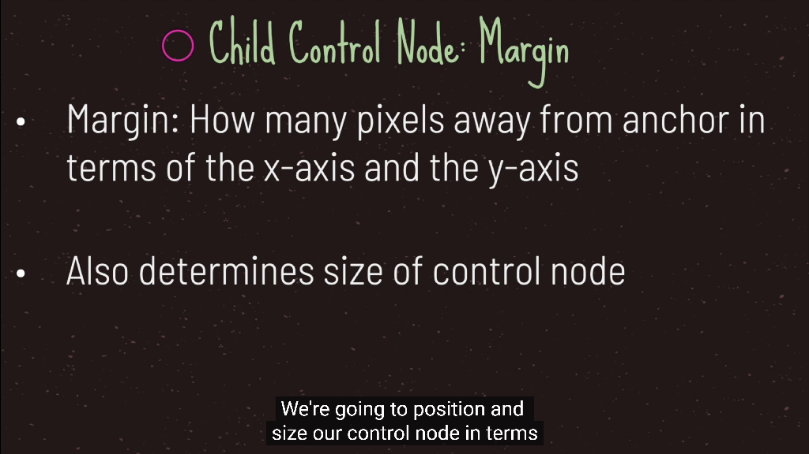

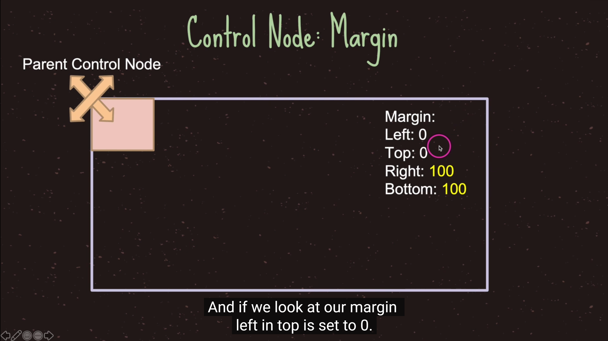
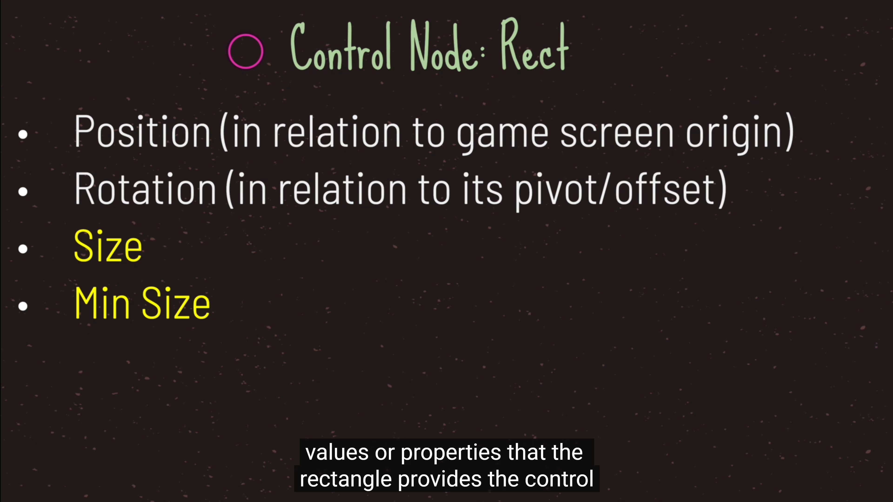
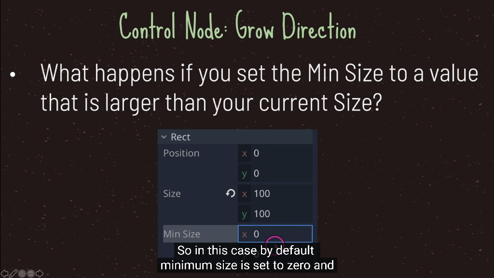
