# 1. Camera2D相机

- Godot的 Camera2D 节点，也就是我们说的摄像机，它提供了不少可以定义的属性来处理游戏中的镜头，并且非常简单。
- 摄像机的作用

```
其实不用添加摄像机，我们的游戏也能够显示出画面来，但是当移动角色时，画面并不会跟着角色移动，正好我们有一个很大的地图，要如何展示呢。

摄像机的作用就是做为屏幕可见区域的镜头，让你可以看到它照到的区域部分。当角色移动或是需要展示其它区域时，移动的就是摄像机的镜头。
```

- 同一时间，只可能有一个摄像机处于激活状态。它是自动的，激活一个，其它的都会被置为未激活状态。

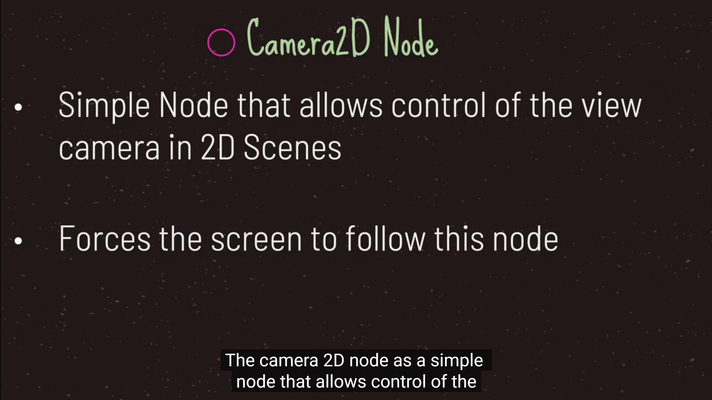
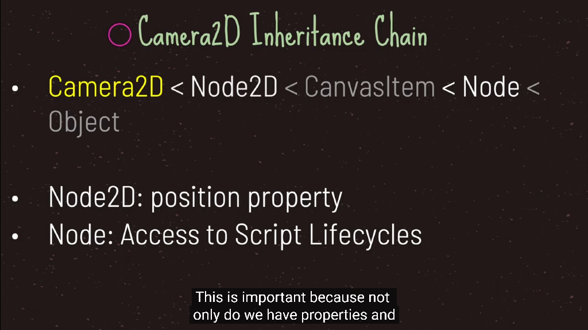
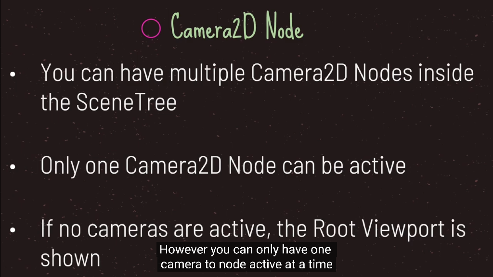
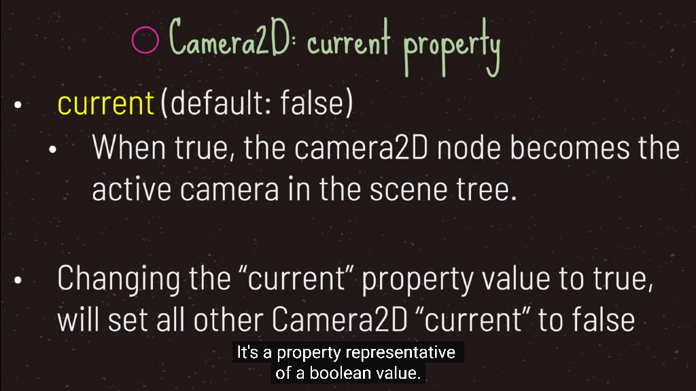
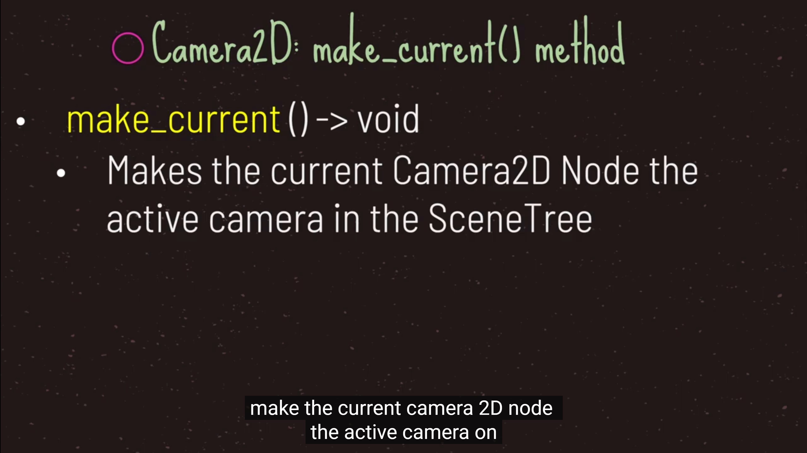
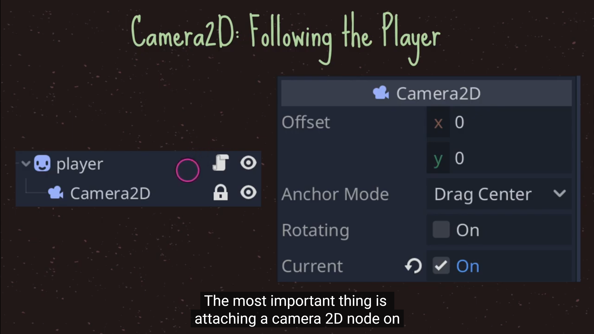

# 2. Viewport可视化窗口实现小窗口

- root就是根节点的viewport

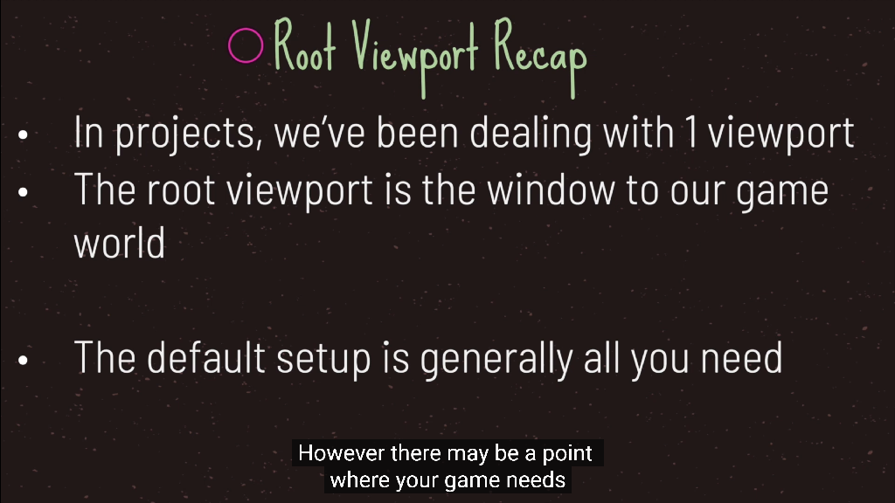
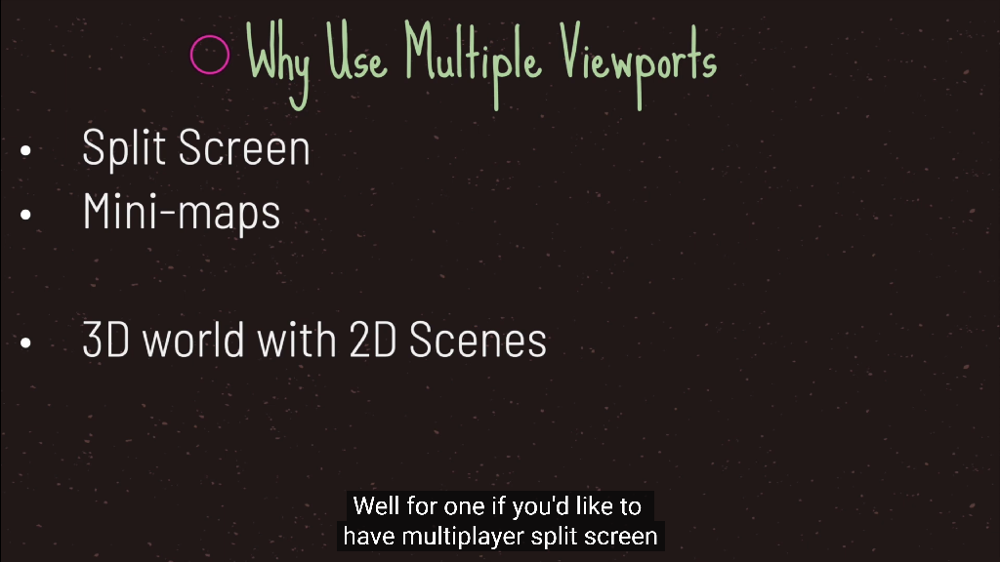
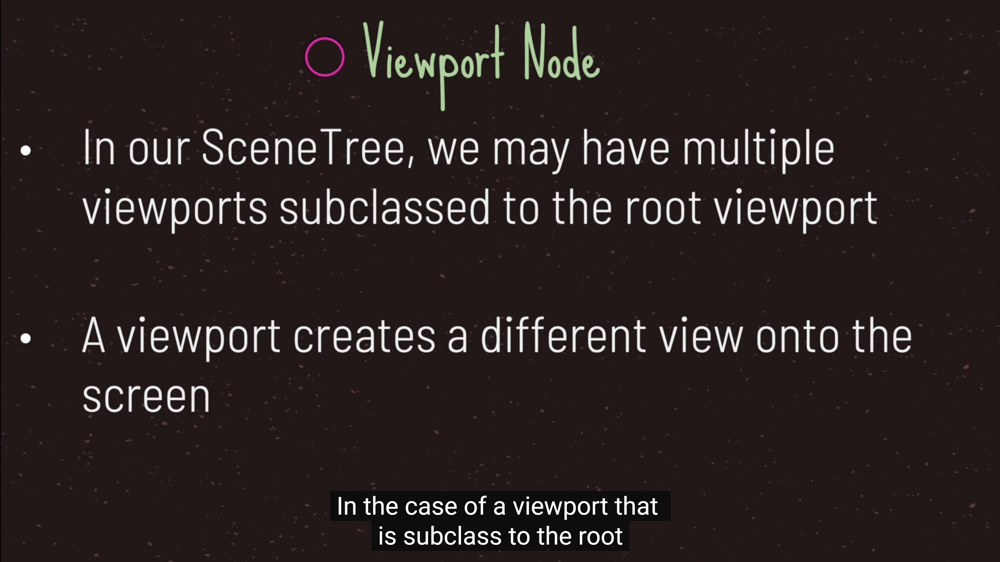
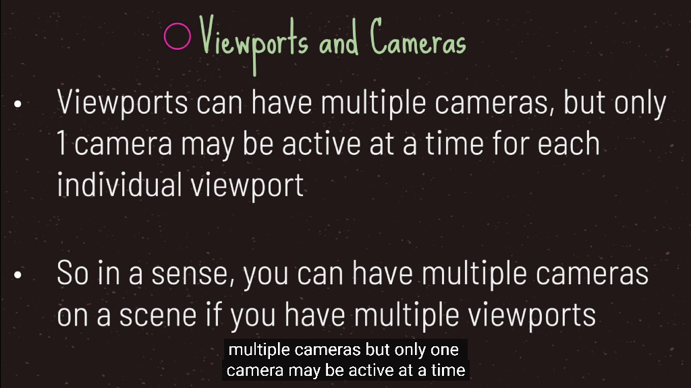
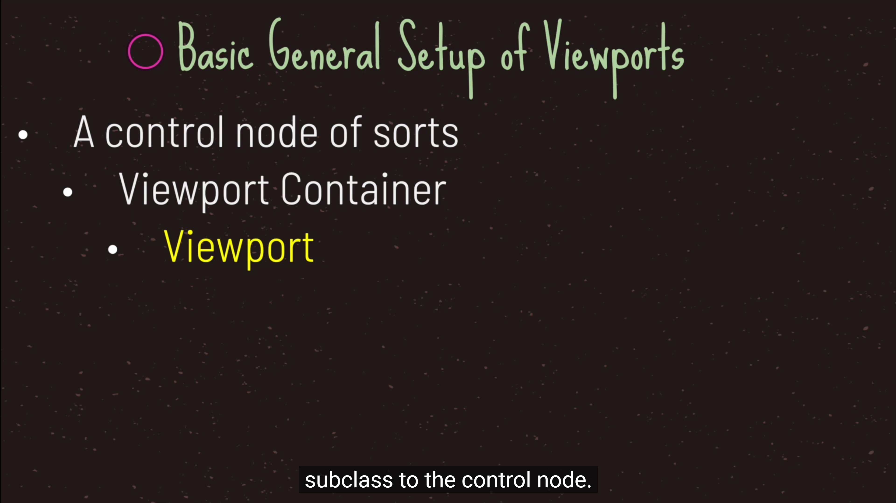
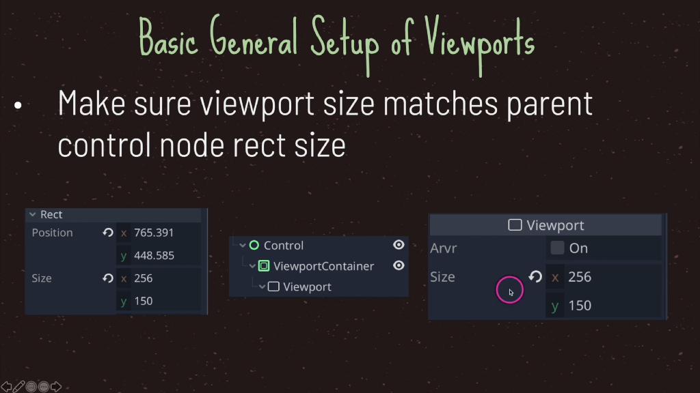
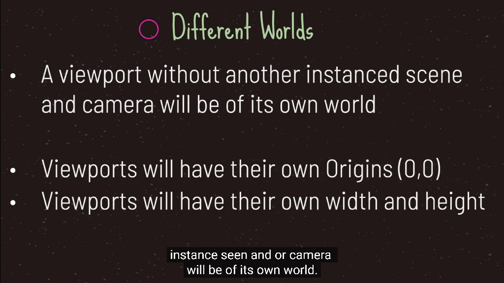
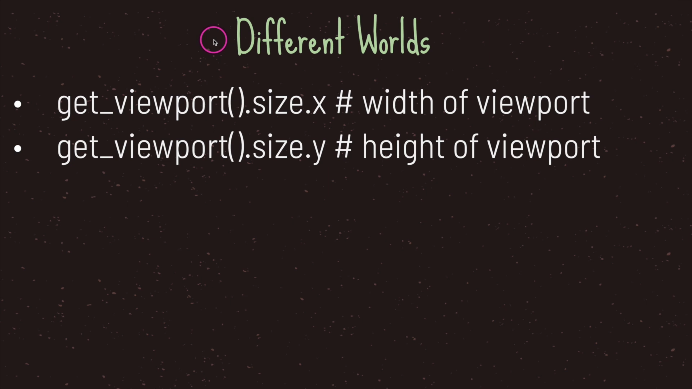
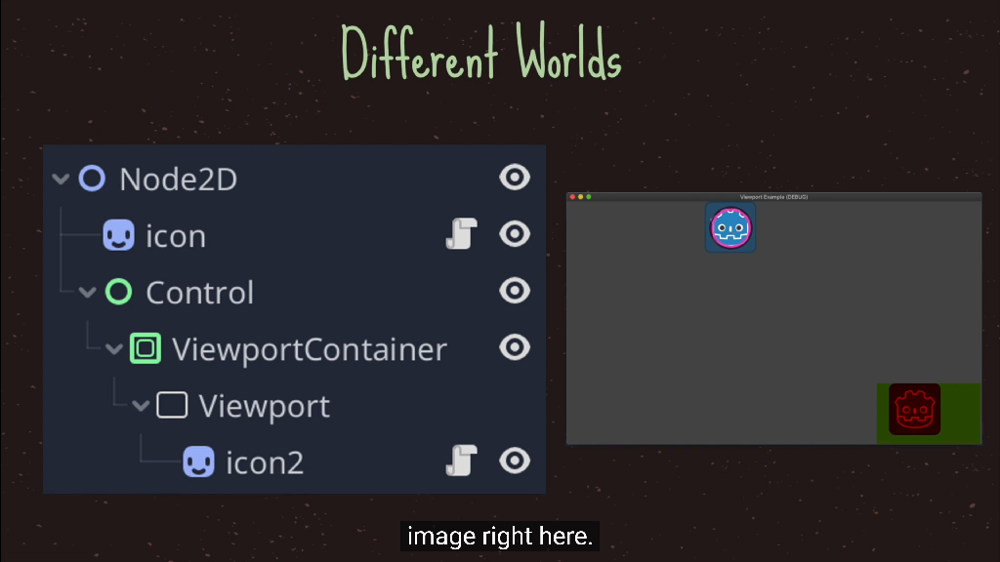
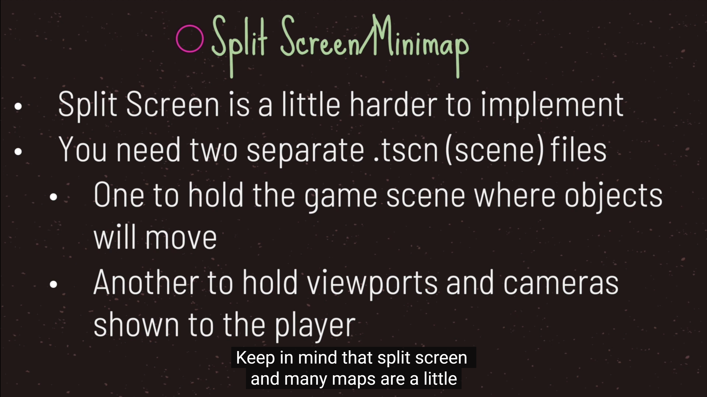
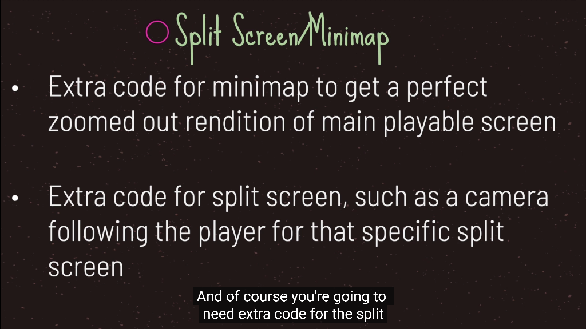

# 3. CanvasLayer节点

- 它是一个节点, 为所有子代和孙代添加一个单独的2D渲染层.
- Viewport的子节点默认在图层 "0 " 处绘制, 而CanvasLayer将在任何数字层处绘制.
- 数字较大的图层将绘制在数字较小的图层之上.CanvasLayers也有自己的变换, 不依赖于其他层的变换.
- 这使得当我们对游戏世界的观察发生变化时,UI可以固定在屏幕空间中.


