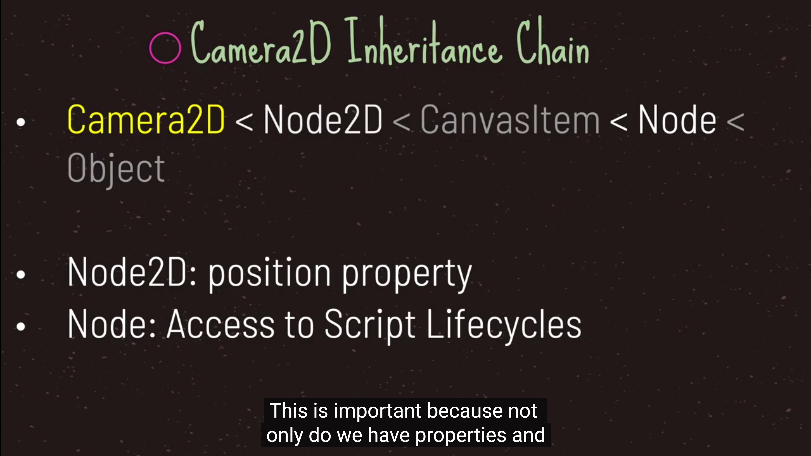
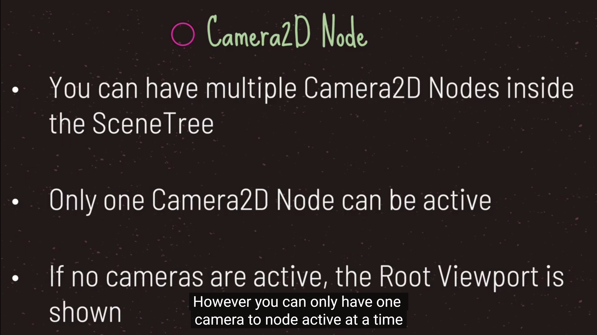
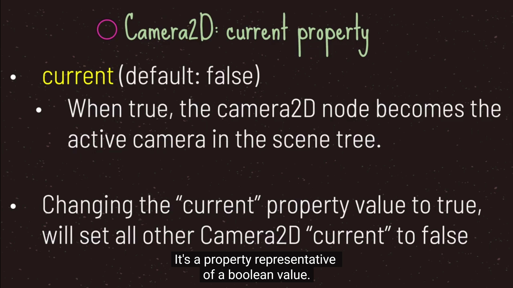
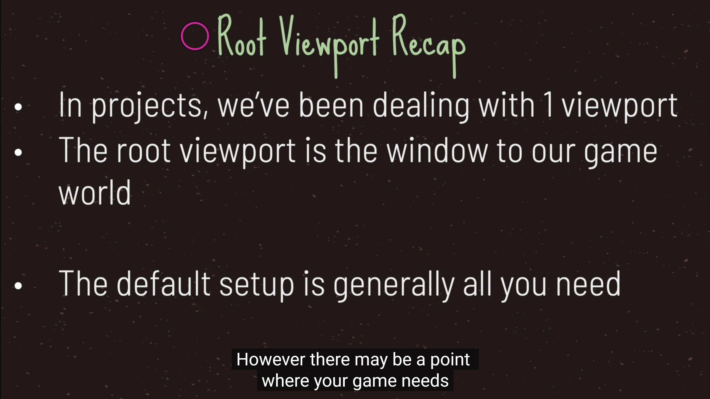
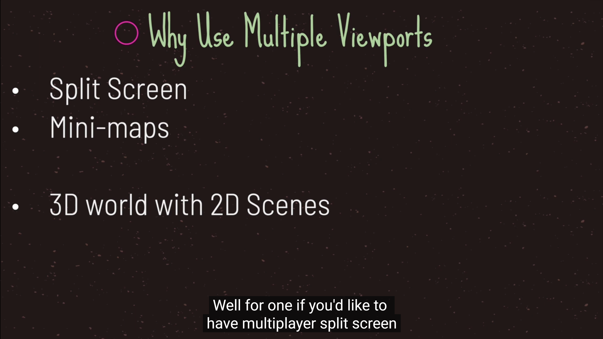
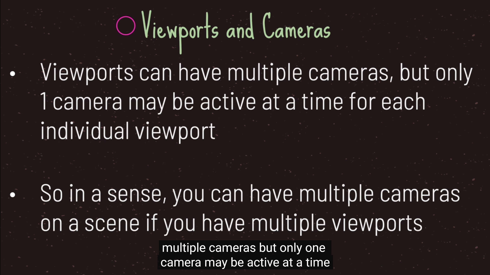
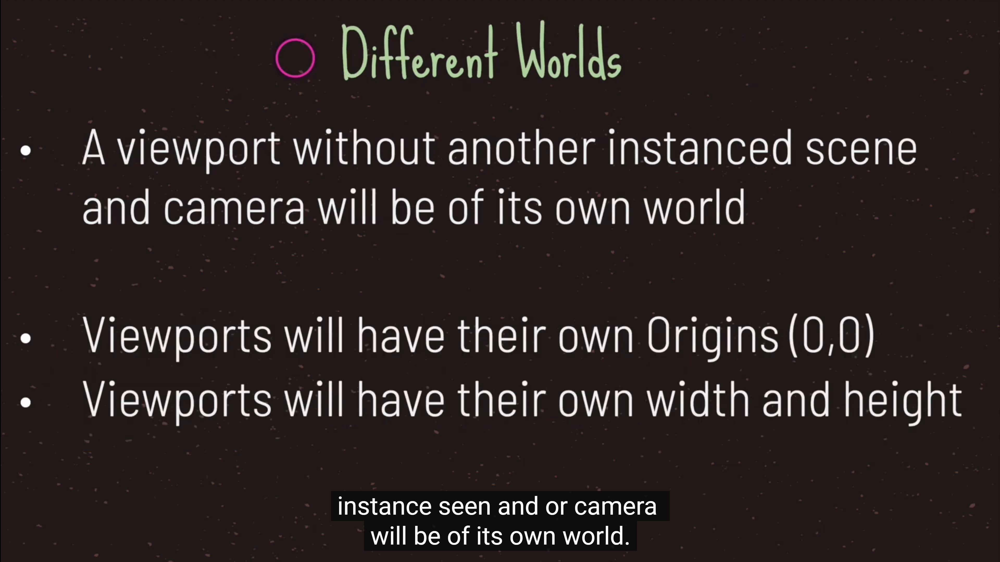
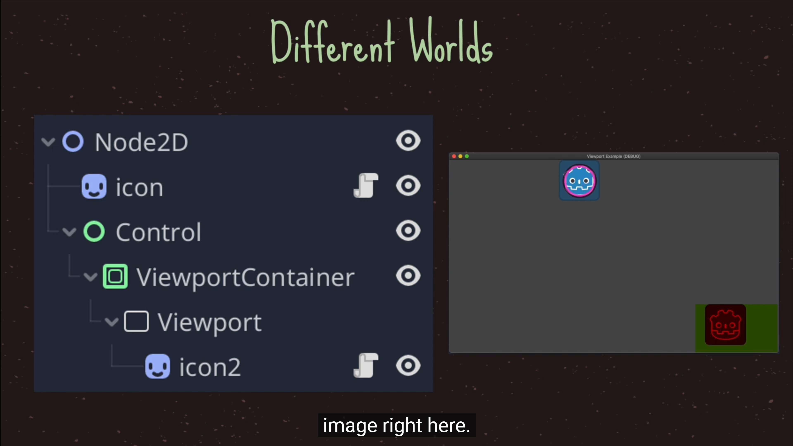
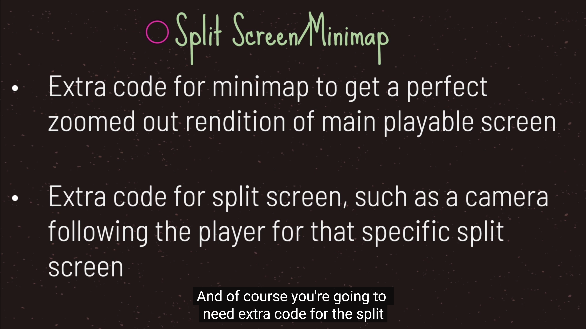

# camera

# viewport(视口，可视化窗口)
- root就是根节点的viewport
  
  
  
  
  
  
  
  
  
  
  

# canvas layer
-  它是一个节点, 为所有子代和孙代添加一个单独的2D渲染层.Viewport的子节点默认在图层 "0 " 处绘制, 而CanvasLayer将在任何数字层处绘制.
- 数字较大的图层将绘制在数字较小的图层之上.CanvasLayers也有自己的变换, 不依赖于其他层的变换. 这使得当我们对游戏世界的观察发生变化时,UI可以固定在屏幕空间中.

